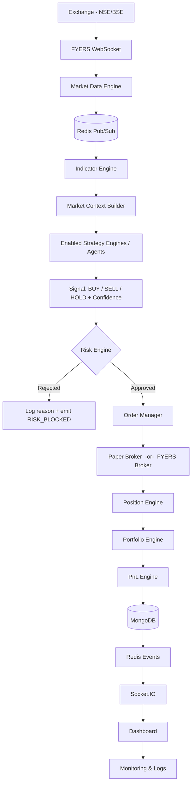
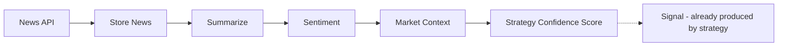
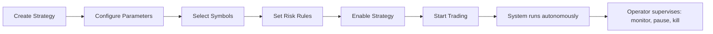

# 00 — Project Overview

> **This is Chapter 0 of the project book.** Read it first. Every other chapter assumes you already hold the mental model established here.
>
> **Reading contract:** This book does not just describe *what* the system does. Every design decision is accompanied by *why it exists* and *what breaks if you remove it*. If you ever find a chapter stating a fact without a reason, treat that as a bug in the documentation and fix it.

---

## 1. What this system is

This is an **autonomous, event-driven algorithmic trading platform**. It ingests live market data from a broker, runs that data through deterministic trading strategies, validates every resulting decision against a risk layer, and executes orders — first against a **paper-trading engine**, and later against a **live broker (FYERS)**. It tracks positions, portfolio, and profit/loss in real time, and streams all of it to a dashboard.

The single most important sentence in this entire book:

> **The human is an operator, not a trader.**

The user does not click "BUY." The user configures a machine that decides *when* to buy and sell, and then supervises it. This distinction is not cosmetic — it dictates the architecture, the dashboard design, the risk model, and the role of AI. If a future change ever reintroduces manual click-to-trade as the *primary* workflow, that change is fighting the design of the entire system.

### What this system is *not*

- **Not a discretionary trading terminal.** There is no manual BUY button in the core execution flow. Manual controls exist only for *supervision* (pause, kill switch), not for *primary execution*.
- **Not an "AI that trades."** The AI does not place orders. It adjusts *confidence* inside a deterministic pipeline it cannot bypass. (See §4.)
- **Not live-first.** Paper trading is the foundation and the default. Live trading is a later, separately-gated capability that reuses the exact same pipeline. (See §6.)

---

## 2. The three load-bearing principles

Everything downstream is a consequence of these three ideas. If you understand nothing else, understand these.

### Principle 1 — The pipeline is deterministic

A market tick enters one end of a fixed pipeline and either becomes an order or gets rejected with a logged reason. The same inputs produce the same decision every time. There is no hidden randomness, no "vibe," and no step that can be skipped under load.

**Why this matters:** Determinism is what makes an autonomous money-moving system *auditable* and *debuggable*. When a trade happens, you must be able to reconstruct exactly why — which candle, which indicator values, which strategy, which risk checks passed. A non-deterministic pipeline is untestable and, with real capital, dangerous. Determinism is also what lets paper trading be a *faithful* rehearsal for live trading: same code path, same decisions.

### Principle 2 — Risk validation runs *before* execution, always

The ordering is fixed and non-negotiable:

```
Signal  →  Risk Engine  →  Broker  →  Position  →  PnL
```

It is **never**:

```
Signal  →  Broker  →  Risk        ← FORBIDDEN
```

**Why this matters:** A risk check that runs *after* the order is placed is not a risk check — it is a post-mortem. Once an order reaches the broker, capital is committed and the outcome is out of your control. The Risk Engine is the last gate that can say "no" while "no" still costs nothing. Placing it after the broker would mean the system can lose money in ways it was explicitly built to prevent (duplicate orders, breaching the daily loss limit, oversized positions, trading outside market hours). This ordering is a safety invariant, not a preference. See **[14_RISK_ENGINE.md](14_RISK_ENGINE.md)**.

### Principle 3 — The dashboard is a control center, not a trading screen

The dashboard exists to *configure and supervise* the machine, not to place trades. Its verbs are: enable/disable strategies, configure parameters, allocate capital, set risk limits, choose symbols, monitor positions, review history and PnL, read AI market summaries, **pause everything**, and **trigger the emergency kill switch**.

**Why this matters:** Interface design shapes behavior. If the dashboard makes manual execution the obvious, prominent action, users will trade discretionarily and undermine the autonomous system — which is the one part that was actually tested and risk-controlled. The dashboard should make *supervision* the primary interaction and treat manual intervention as an exception (pause/kill), not a default. See **[06_FRONTEND_ARCHITECTURE.md](06_FRONTEND_ARCHITECTURE.md)**.

---

## 3. The system at a glance — the master flow

This is the end-to-end path a piece of market data travels. Each stage has a dedicated chapter; the one-line "why" is given here so the shape of the system is legible before you dive in.



| Stage | Why it exists (one line) | Chapter |
|---|---|---|
| **FYERS WebSocket** | A push stream of ticks is the only way to react in real time; polling is too slow and rate-limited. | 19 |
| **Market Data Engine** | Normalizes raw broker payloads into a clean internal tick/candle shape so nothing downstream depends on FYERS's wire format. | 17 |
| **Redis Pub/Sub** | Decouples the data producer from many consumers; one tick fans out to indicators, logging, and the dashboard without tight coupling. | 08 |
| **Indicator Engine** | Turns raw prices into the derived numbers strategies actually reason about (EMA, RSI, VWAP, …). | 18 |
| **Market Context Builder** | Assembles one coherent snapshot (price + indicators + session state + AI sentiment) so a strategy sees a complete picture, not scattered fragments. | 15 |
| **Strategy Engine / Agents** | Where deterministic trading logic lives; each enabled strategy independently analyzes context and may emit a signal. | 15, 16 |
| **Signal + Confidence** | A structured decision object (BUY/SELL/HOLD) carrying a confidence score the AI can later nudge. | 15 |
| **Risk Engine** | The last gate that can veto for free — duplicate check, daily loss, position size, session validity. | 14 |
| **Order Manager** | The single choke point through which *all* orders pass, so execution is uniform and observable. | 12 |
| **Paper / FYERS Broker** | Interchangeable execution backends behind one interface; paper first, live later, same pipeline. | 11, 19 |
| **Position / Portfolio / PnL** | Turn fills into live state: what you hold, what it's worth, and whether you're up or down. | 13 |
| **MongoDB** | Durable system of record for everything that must survive a restart or be audited later. | 07 |
| **Redis Events → Socket.IO → Dashboard** | Push live state to the operator without them refreshing; the control center must reflect reality within moments. | 09, 10, 06 |

> **Notice what is absent from this flow: a manual BUY step.** The operator's actions (create strategy, configure, enable, start) happen *upstream* of this pipeline, not inside it. See §5.

---

## 4. The role of AI — advisor, never executor

The AI subsystem exists to make the deterministic strategies *smarter about context*, not to trade on its own. Its output is a **confidence adjustment**, not an order.



The AI reads news, summarizes it, scores sentiment, and folds that into the market context. A strategy can then weight its signal by this confidence. The AI can make the system *more* or *less* eager, but it **cannot** manufacture a signal the strategy did not produce, and it **cannot** bypass the Risk Engine.

**Why this boundary is drawn so hard:** LLM-generated trading decisions are non-deterministic and can hallucinate. Letting an LLM directly place orders would violate Principle 1 and remove the auditability that makes the whole system safe. By constraining AI to a bounded, numeric input (confidence) that feeds a deterministic, risk-gated pipeline, you get the upside (context awareness, news reaction) without handing an unpredictable component the keys to your capital. See **[20_AI_ENGINE.md](20_AI_ENGINE.md)**.

---

## 5. What the operator actually does

The human's job happens *before* and *around* the pipeline, not inside it.



After "Start," the system analyzes the market, places orders, manages positions, books profit and loss, and repeats — on its own. The operator supervises: watching live positions and PnL, reading AI summaries, and retaining two emergency levers — **pause all trading** and the **kill switch**. Those levers are the *only* first-class manual interventions, and they exist precisely because an autonomous money-mover must always have a hard stop a human can hit.

---

## 6. Phased roadmap — why paper comes first

The system is built in deliberate order. Each phase reuses the previous phase's pipeline rather than replacing it.

1. **Phase 1 — Paper trading (foundation).** The full pipeline runs against a simulated broker that models current price, slippage, and charges but risks no real capital. **Why first:** it lets every other engine (data, indicators, strategy, risk, position, PnL, dashboard) be built and validated end-to-end with zero financial risk. Paper trading is not a toy — it is the proving ground the live system inherits.
2. **Phase 2 — AI assist.** Add the news/sentiment confidence layer on top of the working pipeline. **Why second:** the pipeline must already be trustworthy before you add a component that modulates it, or you can't tell whether a bad trade came from strategy or from AI.
3. **Phase 3 — Live trading (gated).** Swap the paper broker for the FYERS broker behind the same interface. **Why last:** live trading is *only* safe once paper trading has proven the pipeline. Because the broker is an interchangeable backend, going live is a swap, not a rewrite.

Full detail and sequencing live in **[28_ROADMAP.md](28_ROADMAP.md)**.

---

## 7. Technology at a glance (and why each piece)

The full rationale is in **[04_TECH_STACK.md](04_TECH_STACK.md)**; the short version:

| Layer | Choice | Why it's here |
|---|---|---|
| Backend | **Fastify** | Low-overhead, schema-first HTTP server; fast enough to sit in a real-time path. |
| Validation | **Zod** | One source of truth for the shape of every request/config, validated at the boundary so bad data never reaches a service. |
| Realtime transport | **Socket.IO** | Push state to the dashboard the instant it changes, with reconnection handling built in. |
| In-memory / messaging | **Redis** | Pub/Sub fan-out, caching, session storage, rate limiting, and hot market state — the nervous system between components. |
| Background jobs | **BullMQ (on Redis)** | Durable, retryable queues for work that shouldn't block the request/tick path. |
| Durable store | **MongoDB** | Flexible document model fitting the varied shapes here (ticks, orders, strategies, logs) and the system of record. |
| Broker | **FYERS** | The live market-data source (WebSocket) and order backend for Phase 3. |
| Process mgmt | **PM2** | Keeps the backend alive, restarts on crash, manages logs in production. |
| Frontend | **React + query layer + charts** | Component-driven control center consuming REST + Socket.IO. |

---

## 8. How to read this book

The book is organized foundation → subsystems → operations. A suggested reading order for a new contributor:

1. **Orientation:** 00 (this) → 01 Philosophy → 02 Master Architecture.
2. **Foundations:** 03 Monorepo → 04 Tech Stack → 07 Database → 08 Redis → 09 Events → 10 WebSocket.
3. **The trading core:** 11 Paper Trading → 12 Order → 13 Position → 14 Risk → 15 Strategy → 16 Strategy Library.
4. **Data & intelligence:** 17 Market Data → 18 Indicators → 19 Broker → 20 AI.
5. **Cross-cutting & ops:** 05 Backend → 06 Frontend → 21 Auth → 22 Deployment → 23 Monitoring → 24 Security → 25 Coding Standards → 26 AI Assistant Rules → 27 Testing → 28 Roadmap.

### Full chapter map

| # | Chapter | What it answers |
|---|---|---|
| 00 | Project Overview | The mental model and the shape of the whole system *(you are here)*. |
| 01 | Project Philosophy | *Why* operator-not-trader, deterministic, AI-as-advisor — the values behind the design. |
| 02 | Master Architecture | The full system diagram and how every component connects. |
| 03 | Monorepo Structure | How the code is physically organized and why. |
| 04 | Tech Stack | Every technology choice and its justification. |
| 05 | Backend Architecture | Request lifecycle: route → validation → service → repository → response. |
| 06 | Frontend Architecture | Route → layout → provider → query → component → socket → render. |
| 07 | Database Design | Every MongoDB collection: purpose, indexes, relationships, lifecycle. |
| 08 | Redis Architecture | Cache, Pub/Sub, BullMQ, sessions, rate limiting, hot state — and *why* each. |
| 09 | Event-Driven System | The event bus: every event, its producer, consumer, payload, retry, logging. |
| 10 | WebSocket System | How live state reaches the dashboard over Socket.IO. |
| 11 | Paper Trading Engine | The simulated broker: price, slippage, charges, fills. |
| 12 | Order Engine | The single choke point all orders pass through. |
| 13 | Position Engine | Positions, portfolio, and PnL derived from fills. |
| 14 | Risk Engine | The pre-execution gate and why it must run before the broker. |
| 15 | Strategy Engine | Strategy lifecycle from registration to repeating analysis. |
| 16 | Strategy Library | Each strategy explained mathematically (formula, conditions, SL/target, fit). |
| 17 | Market Data Engine | Ingesting and normalizing the broker feed. |
| 18 | Indicator Engine | Computing EMA, RSI, VWAP, and the rest from raw prices. |
| 19 | Broker Integration | FYERS SDK, WebSocket, and the broker interface abstraction. |
| 20 | AI Engine | News → sentiment → confidence, and the hard boundary against execution. |
| 21 | Authentication | Who can operate the system and how identity is proven. |
| 22 | Deployment | Dev PC → GitHub → CI → Docker → VPS → PM2 → running stack. |
| 23 | Monitoring | Logs, metrics, and how you know the system is healthy. |
| 24 | Security | Protecting credentials, broker tokens, and the money-moving path. |
| 25 | Coding Standards | Conventions every contributor (human or AI) follows. |
| 26 | AI Assistant Rules | Rules for Claude Code / AI contributors working in this repo. |
| 27 | Testing | How correctness is proven across the pipeline. |
| 28 | Roadmap | Phased plan: paper → AI → live. |
| — | MASTER_PROJECT_SPECIFICATION | The single-document superset / index tying it all together. |

---

## 9. The chapter template (apply to every subsystem chapter)

To keep 29 documents consistent and prevent architectural drift, **every subsystem chapter uses this skeleton**. This is what stops the book from becoming a pile of unrelated notes.

```markdown
# NN — <Subsystem Name>

## 1. Purpose
What this subsystem is responsible for, in two or three sentences.

## 2. Why it exists
The problem it solves and what would break if it were removed or merged
into something else. (This section is mandatory — no "Redis is used." Explain WHY.)

## 3. Where it sits in the pipeline
Its inputs, its outputs, and the components immediately upstream and downstream.
Include a small diagram.

## 4. How it works
The mechanics, step by step, with the reasoning behind each step.

## 5. Public interface / contract
The functions, events, or API this exposes to the rest of the system, and the
shape of the data it accepts and returns.

## 6. Data & persistence
What it reads/writes in Redis and MongoDB, and why there rather than elsewhere.

## 7. Events produced & consumed
Which bus events it emits and listens for. (Cross-reference Chapter 09.)

## 8. Failure modes & recovery
What can go wrong, how it's detected, retried, logged, and recovered.

## 9. Roadmap
Known gaps and planned evolution for this subsystem.
```

> **Rule for all contributors, human and AI:** every concept has **one** home chapter (single source of truth). Other chapters *link* to it rather than re-explaining it. Duplicated explanations drift out of sync and are the primary cause of documentation rot. See **[26_AI_ASSISTANT_RULES.md](26_AI_ASSISTANT_RULES.md)**.

---

## 10. Glossary (core terms)

- **Operator** — the human running the system. Configures and supervises; does not manually trade.
- **Tick** — a single real-time price update from the broker feed.
- **Candle** — an OHLC (open/high/low/close) bar aggregated over a fixed interval.
- **Indicator** — a value derived from price data (e.g., EMA, RSI, VWAP) that strategies reason about.
- **Market Context** — the assembled snapshot (price + indicators + session state + AI sentiment) a strategy analyzes.
- **Signal** — a structured decision (BUY / SELL / HOLD) emitted by a strategy, carrying a confidence score.
- **Confidence** — a numeric weight on a signal that the AI layer may raise or lower; it never creates or vetoes signals by itself.
- **Risk Engine** — the pre-execution gate (duplicate, daily-loss, position-size, session checks) that can veto a signal at zero cost.
- **Broker (Paper / Live)** — the interchangeable execution backend. Paper simulates fills; Live (FYERS) places real orders.
- **Position** — a currently-held instrument and quantity resulting from fills.
- **Portfolio** — the aggregate of all open positions and available capital.
- **PnL** — profit and loss, realized and unrealized.
- **Kill switch** — the operator's hard stop that halts all trading immediately.

---

*Next: **[01_PROJECT_PHILOSOPHY.md](01_PROJECT_PHILOSOPHY.md)** — the values and reasoning behind operator-not-trader, determinism, and AI-as-advisor, in depth.*
