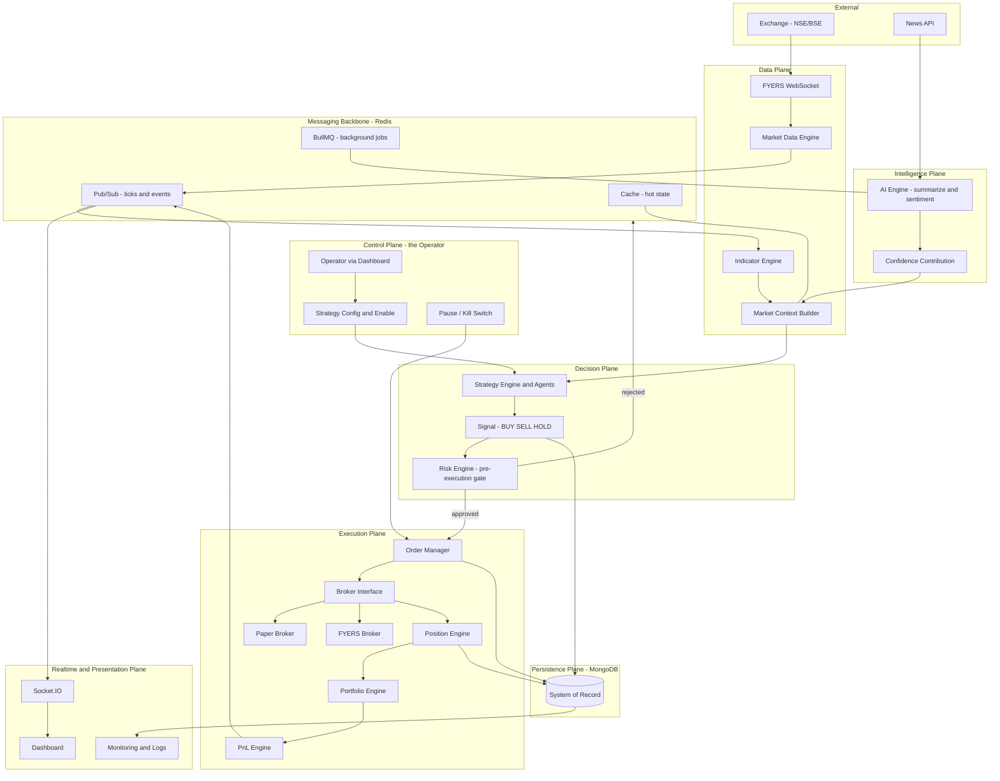
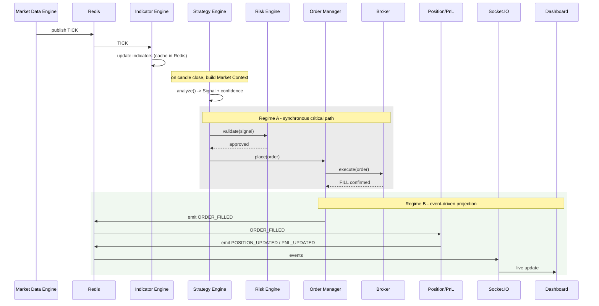

# 02 — Master Architecture

> Prerequisite: **[00_PROJECT_OVERVIEW.md](00_PROJECT_OVERVIEW.md)**. This chapter assumes you already hold the three load-bearing principles (deterministic pipeline, risk-before-execution, dashboard-as-control-center).
>
> This is the **backbone chapter**. Chapters 05–20 zoom into individual components; this chapter is the map that shows how they fit together and, more importantly, *why they talk to each other the way they do*.

---

## 1. Purpose

To describe the whole system as one coherent machine: its architectural style, the planes it's divided into, the engines that live in each plane, and — the part most architecture docs omit — **the rules governing how components communicate and who is allowed to own which piece of truth**. If two engineers ever disagree about "should this go through the event bus or a direct call?" or "who writes the position record?", the answer lives here.

---

## 2. Architectural style, and why

The system is **layered + event-driven, organized around a single deterministic execution pipeline, behind an interchangeable broker**. Four choices, each load-bearing:

1. **Layered (planes).** Responsibilities are grouped into planes (data, decision, execution, persistence, realtime, control, intelligence). **Why:** each plane can be reasoned about, tested, and changed in isolation. A bug in the presentation plane must never be able to reach into the execution plane and cause a bad trade.

2. **Event-driven.** Components announce facts ("a candle closed," "an order filled") rather than reaching directly into each other. **Why:** one fact often has many independent consumers (the dashboard, the logger, the PnL projector, analytics). Broadcasting a fact lets you add or remove consumers without touching the producer. This is what keeps the system extensible as it grows.

3. **A single deterministic pipeline.** Every trade decision flows through the *same* fixed sequence: tick → indicators → context → strategy → signal → risk → order → fill → position → PnL. **Why:** determinism is what makes an autonomous money-mover auditable and testable, and it's what makes paper trading a faithful rehearsal for live trading. There is exactly one road to an order, and it is guarded.

4. **An interchangeable broker.** The pipeline talks to a `Broker` interface, not to FYERS directly. Paper and live brokers are two implementations of that interface. **Why:** going live becomes a *swap*, not a rewrite. The entire pipeline is developed and hardened against the paper broker, then the same code drives real capital by changing which implementation is plugged in. See **[19_BROKER_INTEGRATION.md](19_BROKER_INTEGRATION.md)**.

---

## 3. The complete system map

Planes are drawn as boxes. Solid arrows are the primary data/decision flow; the persistence and realtime planes are fed by facts emitted along the way.



The critical read: **the operator (control plane) sits above the pipeline, not inside it.** Operators inject configuration and can hit the kill path; they do not inject orders. Everything from `Market Data Engine` down to `PnL Engine` runs without a human in the loop.

---

## 4. The seven planes

Each plane has a single concern. Grouping by concern is what lets a failure be contained instead of cascading.

| Plane | Concern | Engines | Deep-dive |
|---|---|---|---|
| **Data** | Get market reality into the system, cleanly. | Market Data Engine, Indicator Engine, Market Context Builder | 17, 18 |
| **Intelligence** | Read the world (news) and translate it into a bounded numeric input. | AI Engine | 20 |
| **Decision** | Turn context into a validated trade decision. | Strategy Engine, Risk Engine | 14, 15, 16 |
| **Execution** | Commit decisions to a broker and track their consequences. | Order Manager, Broker, Position/Portfolio/PnL Engines | 11, 12, 13, 19 |
| **Persistence** | Remember everything that must survive a restart or be audited. | MongoDB | 07 |
| **Messaging backbone** | Move facts between components without coupling them. | Redis (Pub/Sub, Cache, BullMQ) | 08, 09 |
| **Realtime & presentation** | Reflect live state to the operator; record health. | Socket.IO, Dashboard, Monitoring | 06, 10, 23 |
| **Control** | Let the operator configure and stop the machine. | Dashboard config, Kill switch | 06, 14 |

> Why the **Messaging backbone** is drawn as its own plane rather than a shared library: it is the *only* sanctioned way for planes to communicate asynchronously. Keeping it explicit prevents the anti-pattern where the data plane starts reaching directly into the execution plane's internals. If it's not a direct call on the critical path (§6) and it's not a database read, it goes over this backbone.

---

## 5. Engine catalog

Every engine, its one responsibility, and where it's specified. Each engine owns exactly one concern — if you're tempted to give an engine a second job, that's usually a sign a new engine is needed.

| Engine | Single responsibility | Chapter |
|---|---|---|
| **Market Data Engine** | Normalize the raw FYERS feed into internal ticks/candles and publish them. | 17 |
| **Indicator Engine** | Compute derived values (EMA, RSI, VWAP, …) from price data. | 18 |
| **Market Context Builder** | Assemble one snapshot (price + indicators + session + sentiment) per decision. | 15 |
| **AI Engine** | Summarize news, score sentiment, contribute a confidence value. Never trades. | 20 |
| **Strategy Engine** | Run enabled strategies against context; emit signals. | 15 |
| **Risk Engine** | Veto or approve a signal *before* it reaches a broker. | 14 |
| **Order Manager** | The single choke point all orders pass through; talk to the broker. | 12 |
| **Broker (Paper/Live)** | Execute orders; simulate (paper) or place real (FYERS). | 11, 19 |
| **Position Engine** | Derive current holdings from confirmed fills. | 13 |
| **Portfolio Engine** | Aggregate positions and available capital. | 13 |
| **PnL Engine** | Compute realized and unrealized profit/loss. | 13 |

---

## 6. Two communication regimes (the most important section)

The system deliberately uses **two** communication styles, and knowing which applies where is the difference between a correct system and a subtly broken one.

### Regime A — the synchronous critical path (decision → order)

From the moment a signal is produced to the moment an order is handed to the broker, the flow is **synchronous, in-process method calls**:

```
Signal  →  Risk Engine.validate()  →  OrderManager.place()  →  Broker.execute()
```

**Why this must be synchronous and not a queue or event chain:** two of the Risk Engine's checks — the **duplicate-order check** and the **daily-loss / open-exposure check** — must be evaluated *and acted upon atomically* with placing the order. If risk validation and order placement were separated by a queue, two signals could each pass the duplicate check before either one actually places its order, producing exactly the duplicate order the Risk Engine exists to prevent. A synchronous path closes that race window: check and commit happen without an interleaving gap. This regime is also where determinism lives — the same signal + same risk state always yields the same accept/reject, traceable in one call stack.

### Regime B — the event-driven projection path (fill → state)

Once the broker **confirms a fill**, that fill is an immutable fact. Everything downstream of it is a *projection* of that fact and flows over the **event bus**:

```
ORDER_FILLED  →  Position Engine  →  POSITION_UPDATED  →  Portfolio/PnL  →  PNL_UPDATED  →  Dashboard
```

**Why this is event-driven and not more synchronous calls:** a confirmed fill has many independent consumers — position tracking, portfolio aggregation, PnL, the dashboard, the logger, future analytics. None of them can change *whether* the trade happened; they only react to it. Broadcasting `ORDER_FILLED` lets each consumer update independently, lets you add consumers later without touching the Order Manager, and — critically — ensures a slow or disconnected consumer (say, the dashboard) **cannot stall the trading engine**. Presentation is never in the critical path.

*(Rejected alternative: making the whole pipeline event-driven end-to-end. We don't, because it would put a queue between risk validation and order placement, reopening the duplicate-order race described in Regime A. Correctness of the money-moving decision outranks uniformity of style.)*

### The lifecycle in one sequence



---

## 7. Communication mechanisms — when to use which

Four transport mechanisms exist. Using the wrong one is a design smell. This table is the decision rule.

| Mechanism | Use it for | Do **not** use it for | Why |
|---|---|---|---|
| **Direct in-process call** | The synchronous critical path (signal → risk → order). | Cross-cutting notifications; anything with many consumers. | Atomicity and determinism where a race would cost money (§6, Regime A). |
| **Redis Pub/Sub** | Broadcasting facts (ticks, `ORDER_FILLED`, `POSITION_UPDATED`) to many consumers; the event bus. | Guaranteed-once critical decisions. | Fan-out with loose coupling; a slow consumer can't block the producer. |
| **BullMQ (Redis-backed queue)** | Background work that must not block the hot path: news fetch/summarize, token refresh, heavy analytics, notifications. | Real-time tick processing. | Durable, retryable, absorbs bursts; keeps the event loop free (§9). |
| **Socket.IO** | Pushing state from server to the dashboard. | Server-internal communication. | Purpose-built browser transport with reconnection; strictly presentation. |

See **[08_REDIS_ARCHITECTURE.md](08_REDIS_ARCHITECTURE.md)** and **[09_EVENT_DRIVEN_SYSTEM.md](09_EVENT_DRIVEN_SYSTEM.md)** for the concrete channels, event names, and payloads.

---

## 8. State ownership map (single source of truth)

Every piece of truth has **exactly one owning engine** allowed to write it. Everyone else reads (from cache or DB) or receives it via events. This is the rule that prevents the most insidious class of bug — two components both "updating" the same state and drifting apart.

| Truth | Owner (only writer) | Hot copy | Durable copy | Broadcast as |
|---|---|---|---|---|
| Latest price / candle | Market Data Engine | Redis cache | `market_ticks`, `candles` | `MARKET_TICK`, `CANDLE_CLOSED` |
| Indicator values | Indicator Engine | Redis cache | — (recomputable) | `INDICATORS_UPDATED` |
| Strategy config + enabled state | Strategy Engine | Redis cache | `strategies` | — |
| Signals | Strategy Engine | — | `signals` | `SIGNAL_CREATED` |
| Running risk state (daily loss, open count) | Risk Engine | Redis (checked every signal) | reconciled to `risk_logs` | `RISK_BLOCKED` |
| Orders | Order Manager | — | `orders` | `ORDER_PLACED`, `ORDER_FILLED` |
| Positions | Position Engine | Redis cache | `positions` | `POSITION_UPDATED` |
| Portfolio / capital | Portfolio Engine | Redis cache | `positions` / `settings` | — |
| PnL | PnL Engine | Redis cache | derived | `PNL_UPDATED` |
| Broker tokens | Auth/Broker layer | — | `broker_tokens` | `BROKER_CONNECTED/DISCONNECTED` |

> Rule for all contributors: **if you need to change a value you don't own, call its owner or emit an event the owner reacts to — never write it directly.** Direct cross-writes are the number-one cause of "the dashboard says X but the database says Y."

Collection details (indexes, lifecycle) live in **[07_DATABASE_DESIGN.md](07_DATABASE_DESIGN.md)**.

---

## 9. Process & concurrency model

The backend runs on Node.js — a **single-threaded event loop per process** — managed by **PM2** (which keeps it alive, restarts on crash, and handles logs; see **[22_DEPLOYMENT.md](22_DEPLOYMENT.md)**).

The consequence you must design around: **a blocked event loop stalls tick processing, and a stalled tick pipeline means missed trades.** Therefore:

- The **hot path stays light** — tick normalization, indicator updates, context assembly, strategy analysis, risk checks. These must be fast, non-blocking operations.
- Anything **heavy or slow** — news summarization, LLM calls, bulk analytics, token refresh — is pushed to **BullMQ background workers** so it runs off the loop. This is the operational reason the Intelligence plane feeds in via a queue rather than sitting inline: an LLM call taking two seconds must never freeze the two-millisecond tick path.

This is also *why* the AI produces a cached "confidence contribution" that the context builder reads, rather than the strategy calling the LLM synchronously mid-decision (§4, Regime A stays fast and deterministic).

---

## 10. Failure isolation, backpressure & the kill path

An autonomous money-mover must degrade safely, never silently.

- **Producer/consumer decoupling.** Because ticks and events go over Redis Pub/Sub, a slow consumer (e.g., a lagging dashboard) drops behind on its own without back-pressuring the Market Data Engine. The trading core keeps running.
- **Burst absorption.** BullMQ queues absorb spikes in background work (news floods, batch jobs) instead of overwhelming the process.
- **Broker disconnect = stop trading, don't trade blind.** A `BROKER_DISCONNECTED` event must halt *new* order placement and trigger reconnect — the system must never fire orders against a broker it can't confirm. Reconnect then emits `BROKER_CONNECTED` and normal flow resumes.
- **The kill path is privileged.** `Pause` and the `Kill switch` act directly on the Order Manager (the single choke point), so one action stops *all* execution regardless of how many strategies are running. Because every order passes through one place, there is exactly one thing to disable. This is a concrete payoff of the single-choke-point design. See **[14_RISK_ENGINE.md](14_RISK_ENGINE.md)**.
- **Everything is logged.** Rejections (`RISK_BLOCKED`), errors (`SYSTEM_ERROR`), and lifecycle events are emitted and persisted so any outcome can be reconstructed. See **[23_MONITORING.md](23_MONITORING.md)**.

---

## 11. Architectural invariants (must always hold)

These are restated here at the system level because a violation anywhere breaks the whole model:

1. **Determinism** — same inputs, same decision; no step skipped under load. (Principle 1.)
2. **Risk before broker** — `Signal → Risk → Broker`, never `Signal → Broker → Risk`. (Principle 2, and §6 Regime A.)
3. **One choke point** — all orders pass through the Order Manager, so there is one place to observe and one place to stop.
4. **Single source of truth** — each piece of state has exactly one owning writer. (§8.)
5. **Presentation is never in the critical path** — the dashboard consumes events; its health can never affect trading. (§6 Regime B.)
6. **Broker is interchangeable** — the pipeline depends on the `Broker` interface, not FYERS. (§2.4.)
7. **AI advises, never executes** — the AI's only output is bounded confidence into the context. (Chapter 20.)

Any pull request that weakens one of these should be treated as an architectural regression, not a feature.

---

## 12. Why a monorepo

The code lives in one repository with shared packages. **Why:** the backend and frontend must agree on the *exact* shape of every entity and config (a strategy's parameters, an order, a signal). A monorepo lets those shapes be defined once — as shared Zod schemas / types — and consumed everywhere, so a change to the domain model is a single atomic commit rather than a coordination dance across repos. This directly serves the single-source-of-truth invariant, extended from runtime state to the type layer. Structure and boundaries are specified in **[03_MONOREPO_STRUCTURE.md](03_MONOREPO_STRUCTURE.md)**.

---

## 13. Roadmap

- **Phase 1 (now):** the full architecture runs against the **Paper Broker**. Every plane above is exercised end-to-end with zero capital risk.
- **Phase 2:** the **Intelligence plane** is fully activated — news → sentiment → confidence — layered onto the already-trusted pipeline.
- **Phase 3:** the **`Broker` interface** is pointed at the **FYERS Broker**. No pipeline changes; live trading is the swap the interface was designed to enable.
- **Future scaling:** because planes communicate over Redis and heavy work is queued, individual planes (e.g., the Data plane or Intelligence plane) can later be split into separate processes/services with minimal change — the communication contracts already exist. See **[28_ROADMAP.md](28_ROADMAP.md)**.

---

*Previous: **[00_PROJECT_OVERVIEW.md](00_PROJECT_OVERVIEW.md)**  ·  Next: **[03_MONOREPO_STRUCTURE.md](03_MONOREPO_STRUCTURE.md)** — how this architecture is laid out as physical code.*

> Note: **[01_PROJECT_PHILOSOPHY.md](01_PROJECT_PHILOSOPHY.md)** was skipped to reach the architectural backbone first. It's the one foundational chapter still unwritten — it expands the *values* behind these choices. Worth circling back to before the subsystem chapters.
