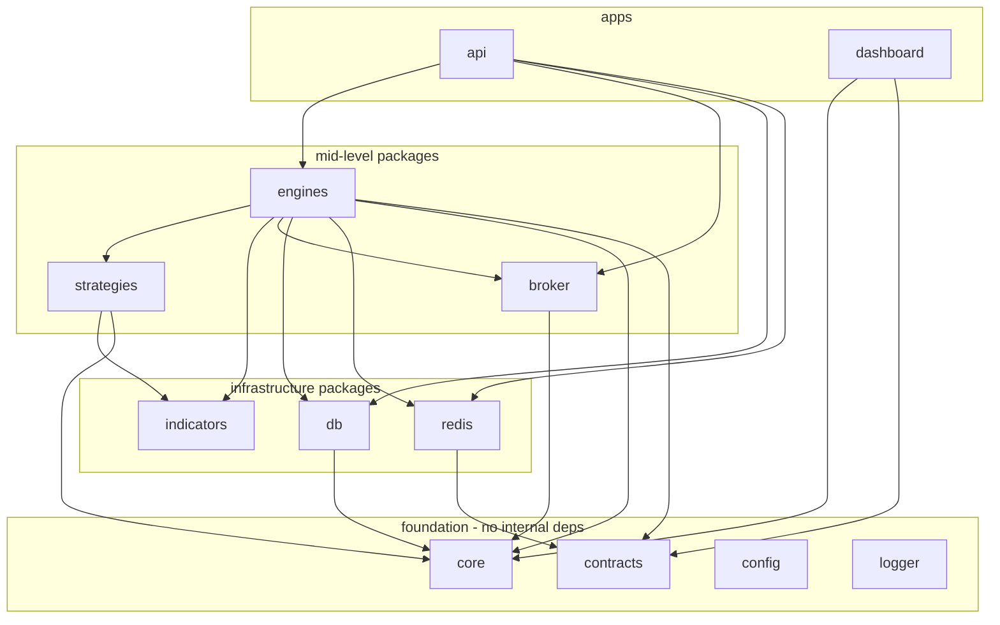

# 03 — Monorepo Structure

> Prerequisite: **[02_MASTER_ARCHITECTURE.md](02_MASTER_ARCHITECTURE.md)** §12 (why a monorepo at all). This chapter turns that decision into a concrete folder layout and the rules that keep it from rotting.

---

## 1. Purpose

To define where every piece of code physically lives, the dependency rules between packages, and why the boundaries are drawn where they are. The layout below is a **proposal with rationale** — adopt it as-is or adjust, but keep the two rules in §5 (dependency direction and single-owner packages), because those are what actually prevent the codebase from tangling as it grows.

---

## 2. Why a monorepo (recap + the concrete payoff)

One repository, multiple packages, one dependency graph. The payoff is specific: the backend and the dashboard must agree on the *exact* shape of every entity — a strategy's parameters, an order, a signal, an event payload. In a monorepo those shapes are defined **once** in a shared package and imported everywhere, so changing the domain model is a single atomic commit that the type-checker validates across the whole system. This extends the single-source-of-truth invariant from runtime state (Chapter 02 §8) up into the type layer.

**Rejected alternative — polyrepo:** separate repos for API and dashboard would force a publish-and-version dance every time a shared shape changes, and let the two sides silently drift out of sync between releases. For a system where a mismatched order shape means a mis-executed trade, that risk isn't worth the isolation polyrepos buy.

---

## 3. Tooling

- **pnpm workspaces** — manages the multiple packages and hoists shared dependencies. Chosen over npm/yarn workspaces for strict, content-addressed `node_modules` (a package can only import what it actually declares — no accidental "phantom" dependencies), which matters when you want package boundaries to mean something.
- **Turborepo** — task runner with caching. Builds/tests only what changed and caches results. **Why:** as the package count grows, rebuilding everything on every change wastes minutes; Turbo's dependency-aware caching keeps the loop fast.
- **TypeScript project references** — enforce the dependency graph at compile time and enable incremental builds.

Concrete configuration lives with the code (`pnpm-workspace.yaml`, `turbo.json`, root `tsconfig.json`); this chapter specifies the *shape*, not the config values.

---

## 4. The layout

```
algo-trade/
├── apps/
│   ├── api/                 # The runtime. Hosts every engine + the control-plane HTTP API.
│   └── dashboard/           # The Nextjs control center.
│
├── packages/
│   ├── core/                # Domain types + Zod schemas. The single source of truth for shapes.
│   ├── contracts/           # Event names, channel names, event payload schemas (the bus contract).
│   ├── config/              # Env loading + validation (fails fast on bad/missing config).
│   ├── logger/              # Shared structured logger.
│   ├── redis/               # Redis client, Pub/Sub helpers, cache helpers, BullMQ setup.
│   ├── db/                  # Mongo client, models, repositories.
│   ├── indicators/          # Pure indicator functions (EMA, RSI, VWAP, …).
│   ├── strategies/          # The strategy library — one module per strategy.
│   ├── broker/              # Broker interface + Paper and FYERS implementations.
│   └── engines/             # Market-data, context, strategy runner, risk, order, position, pnl engines.
│
├── pnpm-workspace.yaml
├── turbo.json
├── tsconfig.base.json
└── package.json
```

### apps/ vs packages/ — the distinction that matters

- **`apps/`** are deployable processes. There are two: the `api` (the Node process PM2 runs, hosting all engines and the HTTP/socket server — see Chapter 02 §9) and the `dashboard` (the browser app).
- **`packages/`** are libraries consumed by apps. **A package boundary is a code-organization boundary, not a process boundary.** The engines live in separate packages for clarity and testability, but at runtime they all boot inside the single `api` process. This is the concrete link to Chapter 02's process model: many packages, one event loop.

Why split the engines into packages at all if they run together? So each engine can be unit-tested in isolation, so its dependencies are explicit, and so a future decision to run (say) the Data plane as its own process is a deployment change, not a code-untangling project — the boundary already exists.

---

## 5. The two rules that prevent rot

### Rule 1 — Dependency direction is one-way (no cycles)

Dependencies flow **downward** only. Apps depend on packages; packages depend on lower packages; the foundation packages depend on nothing internal.



**Why one-way:** cycles between packages make the build order undefined, make code impossible to reason about in isolation, and mean a change in a "leaf" can ripple back into a "root." `core` and `contracts` sit at the bottom and depend on nothing, so they can be imported anywhere without ever creating a loop. Project references make a violation a **compile error**, not a code-review judgment call.

### Rule 2 — Each package has one owner concern

`redis` owns Redis access. `db` owns Mongo access. `broker` owns broker communication. Nothing else opens a Redis connection or writes to Mongo directly. **Why:** this mirrors the runtime single-source-of-truth rule (Chapter 02 §8) at the code level — there is one place that knows how to talk to each external system, so cross-cutting concerns (connection pooling, retries, logging) are implemented once, and swapping an implementation touches one package.

---

## 6. What lives where — quick reference

| Package | Contains | Consumed by | Depends on |
|---|---|---|---|
| `core` | Entity types + Zod schemas (Order, Signal, Strategy, Position, …). | Everything. | nothing |
| `contracts` | Event names, Redis channel names, event payload schemas. | engines, redis, dashboard. | `core` |
| `config` | Typed, validated environment config. | apps, infra packages. | nothing |
| `logger` | Structured logging setup. | everything. | nothing |
| `redis` | Client, Pub/Sub, cache, BullMQ helpers. | engines, api. | `contracts` |
| `db` | Mongo client, repositories, models. | engines, api. | `core` |
| `indicators` | Pure indicator math. | strategies, engines. | `core` |
| `strategies` | One module per strategy (Chapter 16). | engines. | `indicators`, `core` |
| `broker` | `Broker` interface + Paper + FYERS. | engines, api. | `core` |
| `engines` | The trading engines wired to infra. | api. | most of the above |
| `apps/api` | Composition root: boots engines, HTTP + socket server. | — | packages |
| `apps/dashboard` | React control center. | — | `core`, `contracts` |

> Note the dashboard depends on `core` and `contracts` but **not** on `db`, `redis`, `broker`, or `engines`. The browser must never import server-only code; it only needs the shared *shapes* and event *contracts* to render live state correctly.

---

## 7. Testing & config placement

- **Tests are colocated** with the code they test inside each package (`*.test.ts` beside the source), so a package is self-contained and Turbo can run only the affected package's tests. Full strategy in **[27_TESTING.md](27_TESTING.md)**.
- **Environment config** is loaded and validated once in `config` and fails fast on startup if anything required is missing or malformed — you never want a money-moving process to boot half-configured. See **[24_SECURITY.md](24_SECURITY.md)** for how secrets (broker tokens, DB URIs) are handled.

---

## 8. Roadmap

- Internal packages are **not published** to a registry; they're consumed via the workspace. If a package ever needs independent release cadence, that's the trigger to publish it — not before.
- The layout is intentionally ready for **process extraction**: because engines are already separated packages communicating over `redis`/`contracts`, splitting a plane into its own `apps/` process later requires a new composition root and deploy target, not a refactor of engine code (Chapter 02 §13).

---

*Previous: **[02_MASTER_ARCHITECTURE.md](02_MASTER_ARCHITECTURE.md)**  ·  Next: **[04_TECH_STACK.md](04_TECH_STACK.md)** — every technology choice and its justification.*
