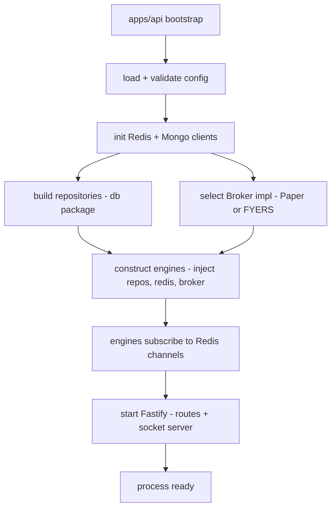
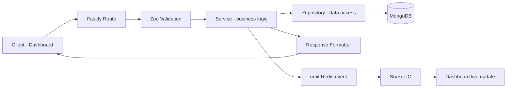

# 05 — Backend Architecture

> Prerequisites: **[02_MASTER_ARCHITECTURE.md](02_MASTER_ARCHITECTURE.md)** (planes, communication regimes) and **[03_MONOREPO_STRUCTURE.md](03_MONOREPO_STRUCTURE.md)** (`apps/api` and the package layout).

---

## 1. Purpose

The `apps/api` process does **two distinct jobs**, and understanding that they are separate is the key to this chapter:

1. **It hosts the autonomous engines** — the whole pipeline from Chapter 02 (market data → … → PnL) boots and runs inside this process.
2. **It serves the control-plane HTTP API** — the request/response endpoints the operator uses to configure the machine (create a strategy, set risk limits, enable/disable, pause, kill).

Job 1 runs continuously without a request. Job 2 responds to operator actions. This chapter specifies both and how they coexist in one process.

---

## 2. Why one process does both

The engines need to be *configurable at runtime* — when the operator enables a strategy or changes a risk limit, the running engines must pick that up. Keeping the API and the engines in the same process means a config change is an in-memory update to live objects (plus a persisted record), not a cross-process message with its own failure modes. It also means one thing to deploy and one thing PM2 supervises (Chapter 02 §9). The trade-off — the API and engines share one event loop — is managed by keeping request handlers light and offloading heavy work to queues (Chapter 04 §8).

---

## 3. The composition root (how engines are wired)

There is exactly **one** place where the concrete engines, the Redis client, the Mongo repositories, and the broker implementation are instantiated and wired together: the composition root in `apps/api` (its `bootstrap`/`main`). Nothing else constructs these dependencies.

**Why a single composition root:** dependencies are injected, not reached for. An engine receives its repository and broker as constructor arguments rather than importing a global. This makes each engine unit-testable with fakes (pass a fake broker, a fake repo), and it makes the Paper-vs-FYERS broker selection a one-line decision at boot (Chapter 02 §2.4) rather than a change scattered across the engines.

**Broker selection at boot** is where Phase 1 vs Phase 3 is decided: the composition root picks the `PaperBroker` or the `FyersBroker` implementation and injects it. The engines never know which one they got — they only know the `Broker` interface. See **[19_BROKER_INTEGRATION.md](19_BROKER_INTEGRATION.md)**.

---

## 4. The control-plane request lifecycle

Every operator API call flows through the same fixed layers. Each layer has one job; the separation is what keeps request handling testable and consistent.

**Layer by layer, and why each exists:**

- **Route (thin).** Declares the endpoint, its schema, and auth requirement, then delegates. It holds no business logic. **Why thin:** routes should be a table of contents, not a place logic hides; keeping them thin means logic lives in services where it can be tested without HTTP.
- **Zod validation (the boundary).** The request body/params/query are parsed against a `core` schema before anything else runs. Invalid input is rejected here with a structured 400. **Why here:** everything past this line may *trust* its inputs (Chapter 04 §4); no service re-checks shape. Trust is earned exactly once, at the edge.
- **Service (business logic).** The actual operation — "create strategy," "update risk limits," "enable strategy" — including any rules, and any live-engine update the action implies. **Why separate from the route:** business logic must be callable and testable independently of the transport, and reusable across endpoints.
- **Repository (data access).** The only code that reads/writes Mongo for that entity, exposing intent-named methods (`strategies.create`, `strategies.setEnabled`). **Why:** services express *what* they want, not *how* Mongo stores it; swapping storage or adding an index touches the repository alone (Chapter 03 §5, Rule 2).
- **Response formatter.** Shapes a consistent success/error envelope so the dashboard always parses the same structure. **Why:** a uniform response contract means the frontend has one code path for results and one for errors.
- **Emit event → Socket.IO.** When an action changes state the operator is watching (e.g., enabling a strategy), the service emits an event that reaches the dashboard live. **Why:** this is the request/response side meeting the realtime side — the acting client gets an HTTP result, and *all* connected dashboards get the state change pushed (Chapter 02 §6, Regime B). The HTTP response confirms the action; the event propagates its effect.

> Contrast with the autonomous path: operator config uses this **request/response** lifecycle because the operator needs confirmation their action succeeded. The trading pipeline does **not** use HTTP at all — it runs on ticks and events. Don't conflate the two: the API configures the machine; the machine trades on its own.

---

## 5. Error handling

One centralized error handler, typed errors, consistent mapping:

- Services throw **typed domain errors** (e.g., `ValidationError`, `NotFoundError`, `RiskViolationError`, `BrokerError`) rather than generic throws.
- A single Fastify error handler maps each typed error to the right HTTP status **and** logs it with context (Chapter 23). **Why centralize:** error-to-status mapping and logging live in one place, so responses are consistent and nothing fails silently.
- **The money-critical distinction:** a failed *config* request (job 2) is a normal HTTP error returned to the operator. A failure in the *pipeline* (job 1) — e.g., a broker rejection or a disconnect — is not an HTTP concern at all; it emits `SYSTEM_ERROR` / `BROKER_DISCONNECTED`, is logged, and triggers the safe-degradation behavior in Chapter 02 §10. Never route pipeline failures through HTTP responses; there's no request to respond to.

---

## 6. Data & persistence

The backend reads/writes Mongo **only through repositories** (`db` package) and Redis **only through the redis package** (Chapter 03 §5). Which engine owns which collection, and the hot-vs-durable split, is the state-ownership map in Chapter 02 §8; collection specifics are in **[07_DATABASE_DESIGN.md](07_DATABASE_DESIGN.md)**.

---

## 7. Events produced & consumed

The API layer primarily **produces** events as side effects of config actions (e.g., strategy enabled) and **consumes** engine events indirectly by relaying them to Socket.IO. The engines it hosts are the main event producers/consumers of the trading pipeline. The full catalog — names, producers, consumers, payloads, retry — is **[09_EVENT_DRIVEN_SYSTEM.md](09_EVENT_DRIVEN_SYSTEM.md)**.

---

## 8. Failure modes & recovery

- **Bad config at startup** → the process fails fast and does not start (Chapter 04 §6). A half-configured money-mover must never boot.
- **Mongo unavailable** → repository operations error; config writes fail loudly; the pipeline's durable logging degrades but in-memory trading state persists in Redis until Mongo returns.
- **Redis unavailable** → this is severe, since Redis is the messaging backbone and hot state. The pipeline cannot safely operate without it; the system should halt new orders and surface the failure. (See Chapter 08 for the resilience posture.)
- **Uncaught error in a request** → caught by the central handler, logged, returned as a clean 500; the process stays up (PM2 would restart it if it crashed).

---

## 9. Roadmap

- The composition root is the seam for **process extraction** (Chapter 02 §13): a future split would give an extracted plane its own bootstrap while reusing the same engine packages and injected dependencies.
- Plugin-per-concern organization in Fastify (auth, error handling, socket, routes) keeps the API surface modular as endpoints grow.

---

*Previous: **[04_TECH_STACK.md](04_TECH_STACK.md)**  ·  Next: **[06_FRONTEND_ARCHITECTURE.md](06_FRONTEND_ARCHITECTURE.md)** — the control center that consumes this API and the live event stream.*
