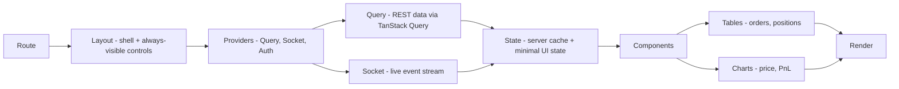

# 06 — Frontend Architecture

> Prerequisites: **[00_PROJECT_OVERVIEW.md](00_PROJECT_OVERVIEW.md)** Principle 3 (dashboard is a control center, not a trading screen) and **[05_BACKEND_ARCHITECTURE.md](05_BACKEND_ARCHITECTURE.md)** (the API and event stream it consumes).

---

## 1. Purpose

To specify how the dashboard is structured, how it gets its data, and — most importantly — how its structure enforces the control-center philosophy: the operator **supervises and configures**; manual trade execution is deliberately *not* the primary interaction. Every layout decision below serves that principle.

---

## 2. Why the frontend is shaped by philosophy, not convenience

Interface design shapes behavior (Chapter 00 §2, Principle 3). If the dashboard makes "place an order" the loud, obvious action, operators will trade discretionarily and undermine the one part of the system that is actually tested and risk-controlled — the autonomous pipeline. So the dashboard is built around *observation and control*: what are my strategies doing, what do I hold, am I up or down, and the two emergency levers (**pause**, **kill**). Manual intervention is present but framed as an exception, not a workflow.

---

## 3. The rendering pipeline

Every page composes through the same layers. This is the frontend analogue of the backend's request lifecycle.

- **Route** — which page (see §4). Routing determines *what the operator is looking at*, nothing more.
- **Layout** — the persistent shell: navigation, connection/system-status indicator, and the **always-accessible pause and kill controls**. **Why in the layout:** emergency controls must be reachable from every page, one action away, never buried inside a screen.
- **Providers** — wrap the app: the Query client (server-state cache), the Socket provider (one shared connection), and Auth (Chapter 21). **Why providers:** one query cache and one socket connection shared across the whole app, rather than each component managing its own.
- **Query / Socket** — the two data channels (§5).
- **State** — predominantly *server state* held in the Query cache, plus minimal local UI state (open modals, form drafts). **Why minimal client state:** the dashboard mostly mirrors server truth; inventing lots of client-side state invites the UI and the server drifting apart (the same anti-pattern as Chapter 02 §8, one layer up).
- **Components → Tables/Charts → Render** — tables for discrete records (orders, positions, signals, logs), charts for continuous series (price, PnL curve).

---

## 4. Pages (the operator's surface)

Each page maps to an operator concern from Chapter 00 §2 (Principle 3):

| Page | Purpose | Primary data channel |
|---|---|---|
| **Strategies** | Create, configure parameters, choose symbols, set per-strategy risk, enable/disable. | REST (config) |
| **Positions** | Live open positions and portfolio. | Socket (live) |
| **Orders** | Order history and current order status. | REST history + Socket updates |
| **PnL** | Realized/unrealized profit and loss over time. | Socket (live) + REST history |
| **AI Summaries** | AI-generated market/news summaries and sentiment. | REST + Socket |
| **Settings** | Capital allocation, global risk limits, broker connection. | REST (config) |
| **Control (global)** | Pause all trading, kill switch, system status. | REST action + Socket status |

> There is intentionally **no "manual trade" page as a primary surface.** If a manual override control exists at all, it belongs behind an explicit, clearly-marked action — never the default path (Chapter 00 §2).

---

## 5. The two data channels — REST vs Socket (and why both)

The dashboard consumes data two ways, mirroring the backend's two regimes (Chapter 02 §6):

- **REST (via TanStack Query)** — for **config and history**: creating a strategy, changing risk limits, fetching order history. **Why REST:** these are request/response actions where the operator needs a confirmed result ("your change was saved") — exactly the backend's control-plane lifecycle (Chapter 05 §4).
- **Socket.IO** — for **live state**: positions, PnL, order fills, system/broker status. **Why Socket:** this data changes continuously and must appear *without the operator refreshing*; polling would be laggy and wasteful. These are the pushed projections from Chapter 02 §6, Regime B.

**How the two reconcile:** when a socket event arrives (e.g., `POSITION_UPDATED`), the handler **updates or invalidates the relevant Query cache entry**, so the same component reads from one place regardless of whether the data first arrived by REST or by socket. This prevents the classic bug of two data sources for one view disagreeing. One cache, two ways to fill it.

---

## 6. Component data-flow example (a live position)

1. Page mounts → Query fetches the current positions snapshot via REST (fast first paint, even before any socket event).
2. Socket provider is already connected; `POSITION_UPDATED` events arrive.
3. The event handler patches the positions entry in the Query cache.
4. The positions table and PnL chart, subscribed to that cache entry, re-render.

**Why snapshot-then-stream:** the REST snapshot gives an immediate correct view on load; the socket stream keeps it live thereafter. Relying on the socket alone would leave the page blank until the next event; relying on REST alone would make it stale.

---

## 7. Failure modes & recovery (the part that protects the operator)

This is where a trading dashboard differs from an ordinary app: **a broken connection must never look like a healthy one.**

- **Socket disconnect** → the layout's status indicator immediately shows a disconnected/stale state, and live panels are visibly marked as not-live. **Why:** an operator glancing at frozen-but-green numbers might assume all is well while the system state has moved on. Honest staleness is safer than a comforting lie. Socket.IO auto-reconnects (Chapter 04 §5); on reconnect, the client refetches snapshots to resync.
- **System/broker halted** → if the backend reports trading paused or the broker disconnected (`BROKER_DISCONNECTED`), the dashboard surfaces it prominently. The operator must know the machine has stopped, not infer it from an absence of updates.
- **Query error/loading** → every data view has explicit loading and error states; no view silently renders empty as if it were "no data."
- **The dashboard cannot break trading.** Because the frontend only *consumes* events and calls the control-plane API (Chapter 02 §11, invariant 5), a frontend crash, a stuck tab, or a disconnected client has zero effect on the autonomous pipeline. This is by design: presentation is never in the critical path.

---

## 8. Data & persistence

The frontend holds **no durable state**. It caches server state in memory (Query cache) for the session and persists nothing money-related locally. Auth/session handling is Chapter 21. (Note: the artifact-storage caveats in the platform don't apply here — this is a real app on the VPS, not a sandboxed artifact.)

---

## 9. Events consumed

The dashboard subscribes to the projection events from Chapter 02 §8 — `ORDER_PLACED`, `ORDER_FILLED`, `POSITION_UPDATED`, `PNL_UPDATED`, `SIGNAL_CREATED`, `RISK_BLOCKED`, `BROKER_CONNECTED/DISCONNECTED`, `MARKET_OPEN/CLOSE`, `SYSTEM_ERROR` — and maps each to a cache update or a status change. Full payloads: **[09_EVENT_DRIVEN_SYSTEM.md](09_EVENT_DRIVEN_SYSTEM.md)**. Transport specifics: **[10_WEBSOCKET_SYSTEM.md](10_WEBSOCKET_SYSTEM.md)**.

---

## 10. Roadmap

- Visual/design language and component-build details are a separate concern; when the actual UI is built, it follows the project's frontend design conventions (Chapter 25) rather than being specified here.
- Potential future surfaces (backtesting views, strategy performance analytics) attach to the same rendering pipeline and data-channel model without changing it.

---

*Previous: **[05_BACKEND_ARCHITECTURE.md](05_BACKEND_ARCHITECTURE.md)**  ·  Next: **[07_DATABASE_DESIGN.md](07_DATABASE_DESIGN.md)** — every MongoDB collection: purpose, indexes, relationships, lifecycle.*
