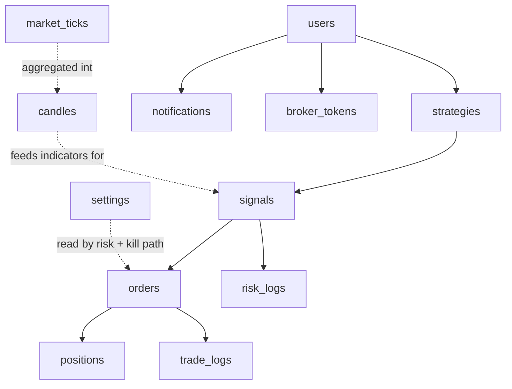

# 07 — Database Design

> Prerequisites: **[04_TECH_STACK.md](04_TECH_STACK.md)** §7 (why MongoDB, and the consistency trade-off) and **[02_MASTER_ARCHITECTURE.md](02_MASTER_ARCHITECTURE.md)** §8 (the state-ownership map — which engine owns which collection).

---

## 1. Purpose

To specify every collection: what it stores, **why it exists**, its key fields, its indexes, its relationships to other collections, and its lifecycle. If you're about to add a field, add an index, or query a collection, the ground truth is here.

---

## 2. Modeling philosophy

Two principles govern the schema:

1. **MongoDB is the durable system of record, not the hot path.** Live, frequently-read values (latest price, current indicator values, running risk counters) live in **Redis** (Chapter 08); Mongo holds what must survive a restart or be **audited** later. So a collection like `market_ticks` is written for durability/replay, while the *latest* tick a strategy reads comes from Redis. Never put a Mongo read on the per-tick hot path.
2. **Reference, don't over-embed, for entities with independent lifecycles.** An order references its signal (`signalId`) rather than embedding a copy, because signals and orders are queried and retained on their own terms. Embedding is used only for data that is truly owned and always read together (e.g., a strategy's `params`, a signal's `contextSnapshot`).

---

## 3. Conventions

- **`_id`** is the Mongo ObjectId; entities the API exposes may also carry a stable public id.
- **Timestamps**: `createdAt`/`updatedAt` on mutable entities; a single `ts` on append-only/event-like records.
- **Append-only vs mutable**: audit collections (`signals`, `risk_logs`, `trade_logs`, `market_ticks`, `candles`) are **write-once** — never updated after creation, because an audit record you can edit is not an audit record. State collections (`strategies`, `orders`, `positions`, `settings`) are mutable via their owning engine only.
- **Soft-delete** for operator-facing entities (`strategies`, `users`): a `deletedAt`/`status` flag rather than physical deletion, so history referencing them stays intact.
- **TTL indexes** on high-volume ephemeral data (§6) to bound growth automatically.

---

## 4. The collections

Each block: **Purpose · Why · Key fields · Indexes · Relationships · Lifecycle.** Owner column refers to Chapter 02 §8.

### `users`
- **Purpose:** operator accounts.
- **Why:** the system must know who is allowed to configure and control it (Chapter 21). Even a single-operator system needs an identity to attach sessions and audit actions to.
- **Key fields:** `email`, `passwordHash`, `role`, `createdAt`, `lastLoginAt`, `status`.
- **Indexes:** unique `{ email }`.
- **Relationships:** referenced by `strategies.ownerId`, `notifications.userId`, `broker_tokens.userId`; sessions live in Redis.
- **Lifecycle:** created at signup → updated on login → soft-disabled, never hard-deleted (preserves audit links).

### `strategies`
- **Purpose:** the operator's strategy configurations and their enabled state.
- **Why:** this is the operator's primary artifact — *what the machine should run*. It is the durable single source of truth for strategy config (Chapter 02 §8, owned by the Strategy Engine), cached in Redis for the engine to read fast.
- **Key fields:** `ownerId`, `type` (e.g., `EMA`, `RSI`, `ORB`), `name`, `params` (embedded, shape depends on `type`), `symbols[]`, `riskRules` (per-strategy overrides), `enabled`, `status`, `createdAt`, `updatedAt`.
- **Indexes:** `{ ownerId }`, `{ enabled }`, `{ type }`.
- **Relationships:** `ownerId → users`; produces `signals` and `orders` (via `strategyId`).
- **Lifecycle:** created → params edited → `enabled` toggled by the operator → soft-deleted. Enabling/disabling is the operator action that starts/stops that strategy's participation in the pipeline.

### `signals`
- **Purpose:** every signal a strategy emits (BUY/SELL/HOLD), accepted or not.
- **Why:** the **decision log**. Determinism (Chapter 02, Principle 1) is only useful if you can reconstruct *why* a decision was made; this collection captures the strategy, the side, the confidence, and the exact context at decision time.
- **Key fields:** `strategyId`, `symbol`, `side`, `confidence`, `contextSnapshot` (embedded: indicator values + price at the moment), `outcome` (`accepted` | `rejected`), `rejectReason?`, `ts`.
- **Indexes:** `{ strategyId, ts }`, `{ symbol, ts }`, `{ ts }`.
- **Relationships:** `strategyId → strategies`; an accepted signal links to an `orders` record.
- **Lifecycle:** **append-only**; retained for analysis; eligible for archival/TTL after a retention window (§6).

### `orders`
- **Purpose:** every order and its execution outcome.
- **Why:** the record of execution — the output of the Order Manager choke point (Chapter 02 §8, §11). One place all orders are recorded means one place to audit execution.
- **Key fields:** `signalId`, `strategyId`, `symbol`, `side`, `qty`, `type` (`MARKET`/`LIMIT`), `price`, `status` (`PLACED`→`FILLED`/`REJECTED`/`CANCELLED`), `mode` (`paper`/`live`), `brokerOrderId`, `slippage`, `charges`, `filledPrice`, `filledAt`, `createdAt`.
- **Indexes:** `{ status }`, `{ strategyId, createdAt }`, `{ brokerOrderId }`, `{ symbol, createdAt }`.
- **Relationships:** `signalId → signals`, `strategyId → strategies`; drives `positions`.
- **Lifecycle:** created `PLACED` → transitions to a terminal status → **immutable once terminal**. `mode` records whether a paper or live broker executed it, so paper and live history are distinguishable in one collection.

### `positions`
- **Purpose:** current holdings and closed positions with their P&L basis.
- **Why:** what we hold, at what average price — the basis for PnL. Owned by the Position Engine; the hot copy is in Redis, the durable copy here.
- **Key fields:** `symbol`, `strategyId`, `side`, `qty`, `avgEntryPrice`, `status` (`OPEN`/`CLOSED`), `realizedPnl`, `unrealizedPnl`, `openedAt`, `closedAt`, `mode`.
- **Indexes:** `{ status }`, `{ symbol, status }`, `{ strategyId }`.
- **Relationships:** `strategyId → strategies`; derived from `orders` fills.
- **Lifecycle:** opened on first fill → updated as fills change quantity → `CLOSED` when flat. `unrealizedPnl` is refreshed from live price (via the PnL Engine), `realizedPnl` finalized on close.

### `market_ticks`
- **Purpose:** normalized raw ticks for audit/replay.
- **Why:** to replay market conditions and audit decisions after the fact. **This is a firehose** — potentially thousands of writes/second — so it is treated differently from every other collection (§6): the *live* tick is served from Redis, and this collection is **TTL-expired** (or sampled) to prevent unbounded growth. Persisting every tick forever would overwhelm storage for little marginal value once candles exist.
- **Key fields:** `symbol`, `ltp`, `volume`, `bid`, `ask`, `ts`.
- **Indexes:** `{ symbol, ts }`; **TTL index on `ts`** (short retention).
- **Relationships:** none (raw data).
- **Lifecycle:** written by the Market Data Engine → auto-expired after the retention window.

### `candles`
- **Purpose:** OHLCV bars per symbol per interval.
- **Why:** **indicators are computed on candles, not raw ticks**, and — critically — on startup the Indicator Engine needs *historical* candles to warm up (an EMA/RSI value depends on prior bars). This collection is what makes indicators correct from the first live candle instead of needing minutes to stabilize. It's also the substrate for future backtesting.
- **Key fields:** `symbol`, `interval` (`1m`/`5m`/…), `open`, `high`, `low`, `close`, `volume`, `ts`.
- **Indexes:** **unique** `{ symbol, interval, ts }` (one bar per symbol/interval/time).
- **Relationships:** none.
- **Lifecycle:** **append-only**, **long retention** (needed for warm-up and backtests). Unlike ticks, candles are compact enough to keep.

### `trade_logs`
- **Purpose:** the human-readable narrative of pipeline activity.
- **Why:** structured collections (`orders`, `signals`) answer "what is the state?"; `trade_logs` answers "what *happened*, in sequence?" — the operational story an engineer reads while debugging an incident. Distinct from `risk_logs` (which is specifically about risk decisions).
- **Key fields:** `type`, `strategyId?`, `orderId?`, `message`, `data`, `ts`.
- **Indexes:** `{ ts }`, `{ strategyId, ts }`.
- **Relationships:** loose references to `strategies`/`orders`.
- **Lifecycle:** append-only; TTL/archive after a retention window (§6).

### `risk_logs`
- **Purpose:** every risk decision, especially rejections.
- **Why:** to **prove the risk gate ran and why it decided as it did** (Chapter 14). If a trade was blocked, the operator must be able to see which check failed; if a bad trade slipped through, this is where you find whether risk approved it. Owned by the Risk Engine.
- **Key fields:** `signalId`, `strategyId`, `checks` (embedded: each check + pass/fail), `decision` (`approved`/`blocked`), `reason`, `ts`.
- **Indexes:** `{ ts }`, `{ decision }`, `{ strategyId, ts }`.
- **Relationships:** `signalId → signals`, `strategyId → strategies`.
- **Lifecycle:** append-only.

### `notifications`
- **Purpose:** operator-facing alerts.
- **Why:** important events (kill switch triggered, large loss, broker disconnected) must reach the operator, not just sit in logs. This backs the dashboard's notification surface (Chapter 06).
- **Key fields:** `userId`, `type`, `severity`, `message`, `read`, `createdAt`.
- **Indexes:** `{ userId, read, createdAt }`.
- **Relationships:** `userId → users`.
- **Lifecycle:** created → marked `read` → TTL after a retention window.

### `news`
- **Purpose:** raw news items and their AI-derived summary/sentiment (Chapter 20).
- **Why:** auditability of the intelligence plane — when a sentiment score nudged a signal's confidence, the operator must be able to trace it back to *which news items* produced it. The live, clamped score lives in a TTL'd Redis cache (Chapter 20 §3.6); this collection is its durable provenance.
- **Key fields:** `headline`, `source`, `url`, `symbols[]`, `publishedAt`, `summary?`, `sentiment?` (embedded: `{ scope, score, rationale }`), `fetchedAt`.
- **Indexes:** `{ symbols, publishedAt }`, `{ publishedAt }` (TTL/archival driver).
- **Relationships:** loosely referenced from signal audits via `contextSnapshot` sentiment values; owned by the AI Engine (sole writer).
- **Lifecycle:** append-only; fetched → enriched with summary/sentiment by the AI jobs → TTL/archived after a retention window (news value decays fast; §6).

### `broker_tokens`
- **Purpose:** FYERS authentication tokens.
- **Why:** broker sessions expire; the feed and order API die without valid tokens. A background job refreshes them **before** expiry to keep the pipeline alive (Chapter 02 §9 — queued work). Tokens are secrets, so they are **encrypted at rest** (Chapter 24).
- **Key fields:** `userId?`, `accessToken` (encrypted), `refreshToken` (encrypted), `expiresAt`, `updatedAt`.
- **Indexes:** `{ userId }`, `{ expiresAt }` (to find tokens nearing expiry).
- **Relationships:** `userId → users`; consumed by the broker layer (Chapter 19).
- **Lifecycle:** created on broker auth → refreshed/rotated by a background job before `expiresAt`.

### `settings`
- **Purpose:** global system settings and per-user overrides — capital allocation, global risk limits, market hours, and the global trading-enabled/pause flag.
- **Why:** the Risk Engine reads global limits (max daily loss, max positions, max position size) from here, and the global **pause/kill** state is persisted here in addition to being held in the Order Manager (Chapter 02 §10). Persisting it is safety-critical: a process restart must **not** silently resume trading after a kill — on boot the system reads this flag and stays halted until the operator explicitly re-enables. Centralizing these means the operator changes one record and every consumer respects it.
- **Key fields:** `scope` (`global`/`user`), `capitalAllocation`, `globalRiskLimits` (embedded), `marketHours`, `tradingEnabled`, `updatedAt`.
- **Indexes:** `{ scope }`.
- **Relationships:** referenced conceptually by the Risk Engine and Order Manager (kill path).
- **Lifecycle:** effectively a singleton for `global` + per-user rows; updated by the operator via the control-plane API (Chapter 05).

---

## 5. Relationships at a glance

Mongo is non-relational, but references form a clear graph:

Solid arrows are stored references (`fieldId`); dotted arrows are logical/data dependencies, not stored foreign keys.

---

## 6. Indexing & retention strategy

**Indexes follow query patterns, deliberately and no further:**
- Dashboard "recent orders for a strategy" → `{ strategyId, createdAt }`.
- "Blocked signals" analysis → `risk_logs { decision, ts }`.
- Candle lookups for indicators → unique `{ symbol, interval, ts }`.

**Why not index everything:** every index is a tax on write throughput. On the tick/candle firehose that tax is real, so high-volume collections carry the *minimum* indexes their reads need. Under-indexing slows reads; over-indexing slows the writes that matter most.

**Retention (bounding growth):**
- `market_ticks` — TTL, short retention (the firehose; live value is in Redis anyway).
- `candles` — long retention (needed for warm-up and backtests; compact).
- `trade_logs`, `notifications` — TTL/archive after a window.
- `signals`, `orders`, `positions`, `risk_logs` — retained (audit-critical, comparatively low volume) with optional cold archival later.

**Why retention is a first-class concern:** an autonomous system runs every trading day indefinitely. Without TTLs, the tick collection alone would grow without bound and eventually degrade the whole database. Bounding growth is not cleanup — it's a correctness requirement for a long-lived process.

---

## 7. Consistency posture

Money-critical consistency in this system is **not** carried by the database. The duplicate-order and exposure guarantees are enforced in-process by the synchronous critical path and single-owner writes (Chapter 02 §6, §8), and every order funnels through the Order Manager choke point. Mongo provides durable, per-document consistency; it does not provide cross-document transactions across this pipeline, and by design it doesn't need to. This is the trade-off recorded in Chapter 04 §7 — revisit it only if the model becomes strongly relational.

---

## 8. Roadmap

- **Time-series collections** for `market_ticks`/`candles` are a natural optimization if volume demands it (Mongo time-series collections compress and index temporal data efficiently).
- **Cold archival** of aged audit records (`signals`, `orders`) to cheaper storage, keeping the working set small.
- **Sharding** by symbol/time is the escape hatch if a single node can't hold the write volume — deferred until measurements demand it, not before.

---

*Previous: **[06_FRONTEND_ARCHITECTURE.md](06_FRONTEND_ARCHITECTURE.md)**  ·  Next: **[08_REDIS_ARCHITECTURE.md](08_REDIS_ARCHITECTURE.md)** — the five roles Redis plays and why.*
