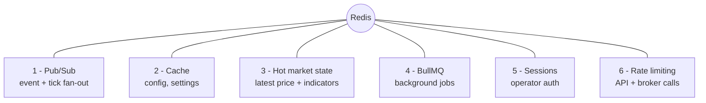

# 08 — Redis Architecture

> Prerequisites: **[02_MASTER_ARCHITECTURE.md](02_MASTER_ARCHITECTURE.md)** §6–7 (the two communication regimes and the transport table) and **[04_TECH_STACK.md](04_TECH_STACK.md)** §6 (why Redis).

---

## 1. Purpose

Redis serves **six distinct roles** in this system. "We use Redis" explains nothing; this chapter states what each role does, **why Redis specifically**, the concrete key/channel conventions, and what happens to each kind of data on restart. If you're about to store something in Redis, this tells you which namespace it belongs in and what durability to expect.

---

## 2. Why Redis is the nervous system

Every role below shares one requirement: **sub-millisecond access on a real-time path.** The Market Context Builder reads the latest price and indicators on *every candle*; the API checks a rate-limit counter on *every request*; the pipeline broadcasts a tick to *many* consumers at once. Redis is the single tool that serves all of these at memory speed. Splitting these across six different systems would multiply operational surface and latency for no benefit — so one Redis instance, cleanly namespaced (§9), plays all six roles.

---

## 3. Role 1 — Pub/Sub (the event & market-data backbone)

- **What:** publish/subscribe channels. The Market Data Engine publishes ticks; every engine publishes its lifecycle events; consumers subscribe.
- **Why Redis Pub/Sub here:** it decouples one producer from many consumers (Chapter 02 §6–7). A tick published once reaches the Indicator Engine, the logger, and the dashboard streamer independently, and a slow consumer (a lagging dashboard) falls behind on its own **without back-pressuring the producer**. Adding a new consumer later requires zero changes to the producer.
- **Channels (proposed convention):**
  - `market:tick:{symbol}` — normalized ticks.
  - `market:candle:{symbol}:{interval}` — closed candles.
  - `events:{EVENT_NAME}` — pipeline events (`events:ORDER_FILLED`, `events:POSITION_UPDATED`, …). Full catalog: **[09_EVENT_DRIVEN_SYSTEM.md](09_EVENT_DRIVEN_SYSTEM.md)**.
- **The critical caveat:** Redis Pub/Sub is **fire-and-forget** — no persistence, no replay. A subscriber that's down misses messages. This is *acceptable* here because (a) a missed tick is immediately superseded by the next one, and (b) the **durable facts** behind events live in Mongo (Chapter 07), so the dashboard can resync from a snapshot on reconnect (Chapter 06 §7). It is also exactly **why the money-critical decision path does NOT use Pub/Sub** — that path is synchronous in-process precisely so no decision can be dropped or raced (Chapter 02 §6, Regime A). Pub/Sub carries *facts to observers*, never *decisions to executors*.

---

## 4. Role 2 — Cache (config & settings)

- **What:** cache frequently-read, infrequently-changed data — enabled strategy configs, global settings.
- **Why:** the Strategy Engine needs the current strategy config constantly; reading Mongo for it on every cycle would put a database round-trip on a hot path (Chapter 07 §2). Caching serves it at memory speed.
- **Keys:** `cache:strategies:enabled`, `cache:settings:global` (with a TTL as a backstop).
- **Invalidation (the part that must be right):** when the operator changes a strategy or a setting, the control-plane service **explicitly busts the cache key** as part of the write (Chapter 05 §4). **Why explicit invalidation, not just TTL:** stale config is dangerous — a cached "enabled" flag for a strategy the operator just disabled could keep it trading. Config writes are rare, so busting the key on write is cheap and keeps the cache truthful. TTL is only a safety net for missed invalidations.

---

## 5. Role 3 — Hot market state (the per-tick read path)

- **What:** the *live snapshot* the pipeline reads every decision — latest price per symbol, latest indicator values per symbol, current session state (open/closed).
- **Why it's separate from general cache:** this is the highest-frequency read in the system. The Market Context Builder assembles price + indicators + session on every candle (Chapter 15); these values are overwritten continuously and must be read instantly. Keeping them in Redis is what lets a strategy see a complete, current picture without touching Mongo.
- **Keys:** `hot:price:{symbol}`, `hot:indicators:{symbol}`, `hot:session`.
- **Owners (single-writer, per Chapter 02 §8):** Market Data Engine writes `hot:price:*`; Indicator Engine writes `hot:indicators:*`; the Market Context Builder only reads.
- **Durability:** deliberately ephemeral. If lost, it rebuilds from the next ticks and from candle history (warm-up, Chapter 07 `candles`). That rebuildability is *why* it lives in Redis rather than Mongo — it's live state, not a record.

> **Related hot state — risk counters.** The Risk Engine keeps its running counters (daily realized loss, open-order/exposure counts) in Redis under the `risk:` namespace for the same reason: they must be checked on **every** signal on the synchronous critical path (Chapter 14). They are owned solely by the Risk Engine (Chapter 02 §8) and reconciled to the durable `risk_logs` audit trail (Chapter 07). Same principle throughout — live, per-decision state belongs in Redis; the durable record belongs in Mongo.

---

## 6. Role 4 — BullMQ (background jobs)

- **What:** durable, retryable queues for work that must stay **off** the hot path — news fetch/summarize, LLM sentiment calls, broker token refresh, notification delivery, heavy analytics.
- **Why:** the event loop must never block (Chapter 02 §9, Chapter 04 §6). A two-second LLM call inline would freeze tick processing, so it's queued and run by a worker. Two further reasons queues (not just async calls) are used: **retries** for transient failures (news APIs and token endpoints fail intermittently and must not silently drop), and **scheduling** (refresh the broker token *before* it expires).
- **Queues:** `jobs:news`, `jobs:ai-summary`, `jobs:token-refresh`, `jobs:notifications`.
- **Durability:** BullMQ persists job state in Redis, so a restart does not lose queued or in-flight jobs. **Why that matters concretely:** a dropped `token-refresh` job would let the broker session expire and kill the live feed/order path — a queued job that survives restarts prevents that class of outage.

---

## 7. Role 5 — Session storage

- **What:** operator authentication sessions.
- **Why:** authenticated requests need a fast session lookup; centralizing sessions in Redis means they can be **invalidated** immediately (logout, or a kill/lockout) and would be shared correctly if the API is ever run as multiple processes (Chapter 02 §13). TTL implements session expiry naturally.
- **Keys:** `session:{sessionId}` with expiry. Details in **[21_AUTHENTICATION.md](21_AUTHENTICATION.md)**.

---

## 8. Role 6 — Rate limiting

- **What:** counters that throttle inbound API requests **and** outbound broker calls, using fixed/sliding windows.
- **Why (two audiences):** inbound limits protect the control-plane API from abuse; **outbound limits protect against the broker's own rate caps.** FYERS throttles or bans clients that exceed its request limits — and a throttled broker connection means the system can't place or manage orders. So broker-call rate limiting isn't a nicety, it's operationally critical to keeping the pipeline alive (Chapter 19).
- **Keys:** `ratelimit:{scope}:{key}` with a TTL matching the window.

---

## 9. Key namespace conventions

One Redis instance serves six roles, so **every key is namespaced by role**:

| Prefix | Role | Durability expectation |
|---|---|---|
| `market:` / `events:` | Pub/Sub channels | fire-and-forget |
| `cache:` | Config/settings cache | rebuildable; TTL + explicit bust |
| `hot:` | Live market snapshot | ephemeral; continuously overwritten |
| `risk:` | Risk running counters | ephemeral; reconciled to Mongo |
| `jobs:` | BullMQ queues | **durable** (persist across restart) |
| `session:` | Auth sessions | durable-ish; TTL = expiry |
| `ratelimit:` | Throttle counters | ephemeral; TTL = window |

**Why namespacing is not cosmetic:** it prevents key collisions, makes keys greppable during incidents, and — most importantly — lets you reason about **eviction and persistence per namespace** (§10). You can look at any key and immediately know whether losing it is harmless or serious.

---

## 10. Durability & eviction posture

Redis here holds two categories of data, and the configuration matches data to criticality:

- **Rebuildable / ephemeral** (`hot:`, `cache:`, `ratelimit:`) — fine to lose on restart; it repopulates from the next ticks or from Mongo. These carry TTLs and evict naturally under memory pressure.
- **Operationally important** (`jobs:`, `session:`) — should survive a restart. Redis persistence (AOF) is enabled so queued jobs and active sessions aren't lost when the process bounces. Eviction policy is chosen so these are not the first to be dropped under pressure.

**Why this split:** treating all Redis data as equally disposable would risk dropping a token-refresh job (outage); treating it all as precious would waste memory persisting caches that rebuild for free. Matching persistence to criticality is the point.

---

## 11. Failure modes & recovery

Redis is the messaging backbone **and** the hot-state store, so its loss is severe — more so than Mongo's (Chapter 05 §8).

- **Redis unreachable** → the pipeline cannot safely operate (no fan-out, no live snapshot). The system halts **new** order placement, surfaces the failure (`SYSTEM_ERROR`, Chapter 09), and attempts reconnect rather than trading blind.
- **Messages lost during an outage** → acceptable by design: Pub/Sub is fire-and-forget, the durable facts are in Mongo, and hot state rebuilds from the next ticks (§3, §5).
- **Recovery** → on reconnect, engines resubscribe, hot state repopulates from incoming ticks/candles, and the dashboard refetches snapshots (Chapter 06 §7). Queued jobs resume from persisted state (§6).

---

## 12. Roadmap

- **Redis Streams** as a durable, replayable alternative to Pub/Sub for the event bus, *if* replay or consumer-groups become necessary (e.g., a new consumer that must not miss historical events). Deferred because current consumers tolerate fire-and-forget.
- **Instance separation** — putting `jobs:` (durable) on a different instance/DB from ephemeral caches if load or persistence tuning demands it.
- **Redis Cluster** for horizontal scale, aligned with the process-extraction path in Chapter 02 §13.

---

*Previous: **[07_DATABASE_DESIGN.md](07_DATABASE_DESIGN.md)**  ·  Next: **[09_EVENT_DRIVEN_SYSTEM.md](09_EVENT_DRIVEN_SYSTEM.md)** — the full event catalog carried over the `events:` channels above.*
