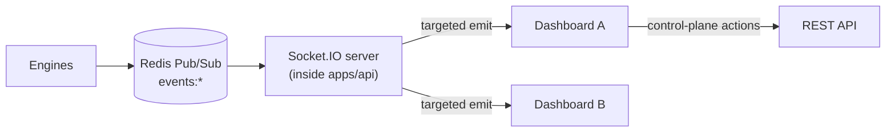

# 10 — WebSocket System

> Prerequisites: **[09_EVENT_DRIVEN_SYSTEM.md](09_EVENT_DRIVEN_SYSTEM.md)** (the events this layer forwards), **[06_FRONTEND_ARCHITECTURE.md](06_FRONTEND_ARCHITECTURE.md)** §5–7 (how the client consumes them), and **[08_REDIS_ARCHITECTURE.md](08_REDIS_ARCHITECTURE.md)** §3.

---

## 1. Purpose

To specify how live state reaches the operator's dashboard: the Socket.IO layer that bridges the internal Redis event bus (Chapter 09) to connected browsers.

**Disambiguation up front — there are two different WebSockets in this system, and this chapter is about only one of them:**
- The **FYERS broker WebSocket** is *inbound* — it feeds market data *into* the Market Data Engine. That's **[19_BROKER_INTEGRATION.md](19_BROKER_INTEGRATION.md)**.
- The **Socket.IO server** is *outbound* — it pushes state *from* the backend *to* the dashboard. **That is this chapter.**

Don't confuse them: one is how the system hears the market; the other is how the operator sees the system.

---

## 2. Why a dedicated push layer

Two requirements force it:

1. **Live state must be pushed, not polled.** Positions, PnL, order fills, and system status change continuously; making the dashboard poll would be laggy and wasteful. The operator must see reality within moments (Chapter 06 §5).
2. **Presentation must never sit in the critical path.** This is invariant 5 (Chapter 02 §11): the Socket.IO layer only *consumes* events and pushes them out. A slow, stuck, or disconnected dashboard has **zero** effect on the trading pipeline. The push layer is deliberately a leaf — data flows to it, never through it.

---

## 3. Architecture — the bridge

The Socket.IO server runs inside `apps/api` (Chapter 05). It subscribes to the internal `events:*` Redis channels (Chapter 08 §3, Chapter 09) and re-emits **selected** events to the **right** connected clients.

**Why bridge rather than let clients read Redis directly:** browsers cannot (and must not) hold Redis connections — that would expose internal infrastructure and every internal event to the client, and bypass auth. The bridge is the controlled boundary: it decides *which* events a *given authenticated* client is allowed to receive, and in what shape.

**Separation of channels (recap):** the dashboard sends **actions** over the REST control-plane API (Chapter 05 §4) and receives **live state** over Socket.IO (this chapter). Requests that need a confirmed result go over REST; continuous state comes over the socket (Chapter 06 §5).

---

## 4. Rooms & targeting

Not every client should receive every event. Socket.IO **rooms** scope delivery:

- **Per-operator room** — each authenticated connection joins a room keyed to its user, so an operator receives only their own strategies/positions/PnL. **Why:** live positions and PnL are sensitive; broadcasting them to every connection would leak one operator's activity to another.
- **Per-subscription rooms (symbols/topics)** — a client viewing a specific symbol or panel can subscribe to just that stream (e.g., ticks/indicators for `NIFTY`), so it isn't flooded with data for symbols it isn't showing.

**Why rooms rather than one global broadcast:** targeting reduces both bandwidth and client-side work, and enforces authorization (a client only ever joins rooms it's entitled to). A global broadcast would be simpler but would leak data and drown clients in irrelevant updates.

---

## 5. Which events are forwarded (and how)

The internal event catalog (Chapter 09) is *not* forwarded verbatim — some events are internal-only, and high-frequency ones are shaped for the browser.

| Internal event | Forwarded to client? | Shaping |
|---|---|---|
| `ORDER_PLACED`, `ORDER_FILLED` | Yes | as-is, to the operator room |
| `POSITION_UPDATED` | Yes | as-is |
| `PNL_UPDATED` | Yes | **throttled/coalesced** (unrealized PnL changes every tick) |
| `SIGNAL_CREATED`, `RISK_BLOCKED` | Yes | as-is (operator visibility) |
| `BROKER_CONNECTED/DISCONNECTED` | Yes | as a **status** update (drives the connection indicator, Chapter 06 §7) |
| `MARKET_OPEN/CLOSE` | Yes | as a status update |
| `SYSTEM_ERROR` | Yes (severe) | surfaced as an alert/notification |
| `MARKET_TICK` | Only if subscribed | **throttled** to a sane render rate; per-symbol room |
| `INDICATORS_UPDATED` | Only if subscribed | throttled |
| `CANDLE_CLOSED` | Only if subscribed | as-is (already low-frequency) |

The client maps each received socket event to a **Query-cache update** (Chapter 06 §5), so components read from one place regardless of source.

---

## 6. Throttling & backpressure

High-frequency events — `MARKET_TICK` and unrealized `PNL_UPDATED` — are **coalesced to the latest value** on a fixed interval before being emitted to clients.

**Why this is required, not optional:** a browser cannot usefully render thousands of updates per second; firing every tick at the client would pin its CPU and freeze the UI while conveying nothing a human can read. Coalescing to "latest value every N milliseconds" gives a smooth, current display at a fraction of the cost. This throttling happens at the bridge (server side), so the flood never leaves the server — the same principle as keeping the hot path light (Chapter 02 §9), applied to the client's benefit.

---

## 7. Authentication & authorization

The socket connection is **authenticated at handshake** — the client presents its session/token (Chapter 21), and an unauthenticated or invalid handshake is rejected before any data flows.

**Why the socket must be authed independently:** it carries the operator's live financial state. An unauthenticated socket would be a direct leak of positions and PnL, bypassing the REST API's auth entirely. Authorization then governs **room membership** (§4): a connection can only join rooms it's entitled to, so authentication (who you are) and authorization (what you may receive) are both enforced at the socket boundary.

---

## 8. Reconnection & resync

Socket.IO auto-reconnects (Chapter 04 §5). The reconnect protocol matters because Pub/Sub is fire-and-forget (Chapter 09 §4) — a client that was disconnected **missed** events:

1. On drop, the dashboard immediately shows a **disconnected/stale** state (Chapter 06 §7) — never frozen-but-green.
2. On reconnect, the client **re-authenticates, rejoins its rooms, and refetches REST snapshots** to resync (Chapter 06 §6, snapshot-then-stream).
3. The server handles reconnection idempotently — re-joining a room and resuming forwarding requires no special server state.

**Why resync-on-reconnect instead of server-side replay:** the durable truth is in Mongo (Chapter 07), so refetching a snapshot is simpler and more reliable than having the socket layer buffer and replay missed events. This is the same design choice as Chapter 09 §4, case 1, seen from the client side.

---

## 9. Failure modes

- **Client disconnects** → surfaced as stale; auto-reconnect + resync (§8). No effect on trading (§2).
- **Server can't reach Redis** → no events to forward; the dashboard sees staleness while the backend surfaces `SYSTEM_ERROR` (Chapter 08 §11). The socket layer failing does not stop the pipeline.
- **Slow client** → throttling (§6) plus Socket.IO's own buffering absorb it; a client that can't keep up degrades on its own without back-pressuring the server.

---

## 10. Roadmap

- **Socket.IO Redis adapter** — if `apps/api` is ever run as multiple instances (Chapter 02 §13), the adapter lets an event received by one instance reach clients connected to another. This is the direct enabler for scaling the socket layer horizontally, and it reuses the Redis already present (Chapter 08).
- **Finer per-symbol/per-panel subscriptions** and payload compression for high-volume streams, if bandwidth becomes a constraint.

---

*Previous: **[09_EVENT_DRIVEN_SYSTEM.md](09_EVENT_DRIVEN_SYSTEM.md)**  ·  Next: **[11_PAPER_TRADING_ENGINE.md](11_PAPER_TRADING_ENGINE.md)** — the simulated broker at the heart of Phase 1.*
