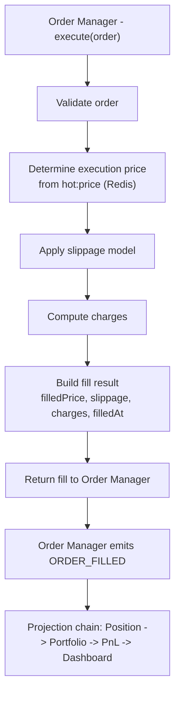

# 11 — Paper Trading Engine

> Prerequisites: **[00_PROJECT_OVERVIEW.md](00_PROJECT_OVERVIEW.md)** §6 (phased roadmap — why paper is the foundation), **[02_MASTER_ARCHITECTURE.md](02_MASTER_ARCHITECTURE.md)** §2.4 (the interchangeable `Broker`), and **[09_EVENT_DRIVEN_SYSTEM.md](09_EVENT_DRIVEN_SYSTEM.md)** (`ORDER_FILLED`).

---

## 1. Purpose

The Paper Trading Engine is the **`PaperBroker`** — one implementation of the `Broker` interface (Chapter 19) that **simulates order fills** using the current market price, a slippage model, and a charge model, **without risking real capital**. In Phase 1 it is the broker the entire pipeline executes against.

---

## 2. Why paper trading is the foundation, not a toy

Paper trading is the proving ground the live system inherits (Chapter 00 §6). Its value depends on one property: **fidelity.** Because the Paper Broker sits behind the *same* `Broker` interface as the live FYERS broker, and because everything downstream of a fill is the *same* event-driven projection (Chapter 02 §6, Regime B), a strategy that behaves correctly on paper behaves the same way live — the only thing that changed is which `Broker` implementation was injected at the composition root (Chapter 05 §3).

This is also **why the simulation must model slippage and charges** rather than filling at the exact quoted price for free: a paper engine that fills perfectly and costlessly would report profits the live market would never deliver, making Phase 1 a comforting lie instead of a rehearsal. Realistic costs are what make paper P&L predictive.

---

## 3. Where it sits

The Order Manager (Chapter 12) calls `Broker.execute(order)` on the synchronous critical path (Chapter 02 §6, Regime A). In Phase 1 that call lands on the Paper Broker, which produces a **fill result**. The Order Manager then emits `ORDER_FILLED`, which starts the projection chain (position → portfolio → PnL → dashboard). **The Paper Broker does not update positions itself** — it only simulates the fill and returns it; the identical downstream path handles the rest, exactly as it will for live orders.

> Any order reaching the broker has **already passed the Risk Engine** (session, duplicate, position-size, and daily-loss checks — Chapter 14), because risk runs *before* the broker (Chapter 02 §6, Principle 2). So the Paper Broker does **not** re-validate capital or exposure — that's not its job. It assumes a risk-approved order and focuses solely on producing a realistic fill. This is the same division of labor the live broker will have.

---

## 4. How a fill is simulated

Each step, with its rationale:

1. **Validate the order.** Valid symbol, market open (via `hot:session`, Chapter 08 §5), sane quantity and (for limit orders) price. **Why:** the Paper Broker should reject what a real broker would reject, so invalid-order handling is exercised in Phase 1, not discovered in Phase 3.
2. **Determine the execution reference price.** Read the current price from `hot:price:{symbol}` (Chapter 08 §5). For a **MARKET** order this is the last traded price; for a **LIMIT** order the fill occurs only if the market price satisfies the limit. **Why read from Redis hot state:** it's the live snapshot the whole pipeline shares — the paper fill uses the same price reality the strategy saw.
3. **Apply the slippage model.** Adjust the execution price adversely by a configurable slippage (fixed ticks, a percentage, or volatility-scaled). **Why:** real market orders rarely fill exactly at the quote; slippage makes fills honest and prevents strategies from looking better than they'd trade.
4. **Compute charges.** Apply the charge model (§5). **Why:** trading costs directly reduce PnL; omitting them overstates profitability.
5. **Build the fill result.** `filledPrice`, `slippage`, `charges`, `filledAt`, `qty`. Return it to the Order Manager, which persists the order as `FILLED` (Chapter 07 `orders`, `mode: paper`) and emits `ORDER_FILLED`.

For a MARKET order the fill is effectively immediate; for a LIMIT order the Paper Broker holds it pending and fills when the market price crosses the limit (or leaves it open/cancellable).

---

## 5. The charge model

Paper PnL must reflect the **real** cost stack, which on Indian exchanges (FYERS) is a composite. The model includes these components, configurable per segment (equity intraday/delivery, F&O) to match the broker's actual fee schedule:

- **Brokerage** (per the broker's plan — e.g., flat per executed order for intraday/F&O).
- **STT/CTT** (securities/commodities transaction tax).
- **Exchange transaction charges.**
- **SEBI turnover fee.**
- **GST** (on brokerage + transaction charges).
- **Stamp duty.**

> The chapter deliberately does **not** hardcode rates — they differ by segment and change over time. The model is parameterized so it can be kept equal to the live broker's real charges; that equality is the whole point (fidelity, §2). Exact current rates belong in configuration, not in this document.

---

## 6. Public interface

The Paper Broker implements the same `Broker` contract as the live broker (Chapter 19), so the Order Manager is agnostic to which one it holds:

- `execute(order)` → returns/confirms a fill (or a rejection).
- `cancel(orderId)` → cancels a pending (e.g., unfilled limit) order.
- `status(orderId)` → current order status.

**Why identical interface:** this is what makes Phase 3 a swap, not a rewrite (Chapter 02 §2.4). No pipeline code branches on "is this paper or live?"

---

## 7. Data & persistence

- **Reads:** `hot:price:{symbol}`, `hot:session` from Redis (Chapter 08 §5).
- **Writes:** none directly to Mongo — the *order* record (including `mode: paper`, `slippage`, `charges`, `filledPrice`) is persisted by the Order Manager (Chapter 12, Chapter 07 `orders`). This keeps persistence ownership with the Order Manager choke point rather than split across brokers.

---

## 8. Events

- **Consumes:** nothing over the bus — it's invoked synchronously by the Order Manager (Chapter 02 §6, Regime A).
- **Produces:** nothing directly. The Order Manager emits `ORDER_PLACED`/`ORDER_FILLED` (Chapter 09) around the broker call, so paper and live emit the *same* events from the *same* place.

---

## 9. Failure modes

- **Market closed / no session** → reject the order (mirrors live and the Risk Engine's session check, Chapter 14).
- **No current price available** (`hot:price` missing, e.g., feed gap) → cannot fill; reject/hold and log, rather than inventing a price. **Why:** a fabricated fill price would corrupt paper PnL and mislead the operator.
- **Invalid order** (bad qty/price) → reject with a reason.

---

## 10. Configuration knobs (realism)

Slippage magnitude, charge parameters, and optional simulated fill latency are configurable. **Why expose these:** they let the operator tune how conservative the simulation is — a higher slippage assumption produces a stricter, more pessimistic rehearsal, which is often the safer way to validate a strategy before it touches real money.

---

## 11. Roadmap

- **Richer fill modeling** — partial fills, order-book-depth-aware slippage, and probabilistic rejection — so paper approximates live microstructure even more closely.
- **Recorded-tick replay** — running the Paper Broker against recorded market data (Chapter 07 `candles`/`market_ticks`) to make paper runs reproducible for testing (Chapter 27).

---

*Previous: **[10_WEBSOCKET_SYSTEM.md](10_WEBSOCKET_SYSTEM.md)**  ·  Next: **[12_ORDER_ENGINE.md](12_ORDER_ENGINE.md)** — the single choke point that calls this broker.*
