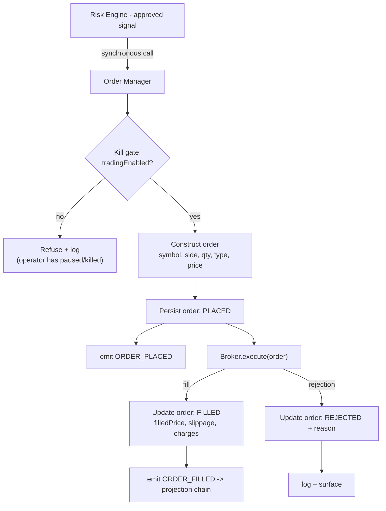

# 12 — Order Engine

> Prerequisites: **[02_MASTER_ARCHITECTURE.md](02_MASTER_ARCHITECTURE.md)** §6 (Regime A ends here; Regime B begins here), §10 (the kill path), and **[14_RISK_ENGINE.md](14_RISK_ENGINE.md)** (everything arriving here is already risk-approved).

---

## 1. Purpose

The Order Manager is the **single choke point** through which every order in the system passes — paper or live, from any strategy. It turns a risk-approved signal into a broker order, submits it, owns the order's lifecycle and persistence, and emits the events that start the downstream projection chain.

---

## 2. Why a single choke point (invariant 3)

Three payoffs, each impossible with scattered execution:

1. **One switch stops everything.** Pause and the kill switch act *here* (Chapter 02 §10). Because there is exactly one road to the broker, disabling one component halts all execution regardless of how many strategies are running. If strategies could call brokers directly, "stop trading" would mean hunting down N call sites.
2. **One audit stream.** Every order — its origin signal, its parameters, its outcome — is recorded by one component into one collection (`orders`, Chapter 07). Execution history has no gaps and no alternate paths.
3. **One place to be careful.** Broker interaction has sharp edges (timeouts, unknown outcomes, §8). Concentrating that logic in one engine means it's written and hardened once, not re-implemented per strategy.

---

## 3. Where it sits

The Order Manager is the **end of Regime A and the start of Regime B** (Chapter 02 §6): it is called synchronously with a risk-approved signal, and after the broker responds it emits events asynchronously.



---

## 4. Responsibilities, step by step

1. **The kill gate.** Before anything else, check the global `tradingEnabled` flag (Redis-cached, Mongo-persisted — Chapter 07 `settings`, Chapter 08 §4). If the operator has paused or killed, **no order proceeds**, full stop. **Why the gate lives here and not in the Risk Engine:** the kill switch must be absolute and simple — one flag checked at the one place all orders pass. Risk checks evaluate *this* signal; the kill gate ignores the signal entirely and asks only "is the machine allowed to trade at all?"
2. **Construct the order.** Translate the approved signal into a broker order: symbol, side, quantity (proposed by the strategy's sizing rules and already validated/capped by the Risk Engine, Chapter 14), order type (MARKET/LIMIT), and price if applicable. **Why construction happens here:** signals are *decisions*; orders are *broker instructions*. Keeping the translation in one place means the broker-facing shape is uniform no matter which strategy decided.
3. **Persist first, then submit.** The order is written to `orders` with status `PLACED` **before** the broker call, and `ORDER_PLACED` is emitted. **Why persist-first:** if the process dies mid-submission, there must be a durable record that an order *may* exist at the broker — the recovery procedure (§8) depends on it. An order that exists only in memory during the broker call is an order that can be lost and double-placed.
4. **Submit via the `Broker` interface.** `Broker.execute(order)` — Paper in Phase 1, FYERS in Phase 3, injected at boot (Chapter 05 §3). The Order Manager neither knows nor cares which (Chapter 11 §6).
5. **Record the outcome.** On fill: update to `FILLED` with `filledPrice`, `slippage`, `charges`, `filledAt`, and emit `ORDER_FILLED` — the pivotal fact the whole projection chain hangs off (Chapter 09). On rejection: update to `REJECTED` with the broker's reason, log, surface.

---

## 5. The order state machine

```
PLACED ──▶ FILLED        (terminal)
   │────▶ REJECTED       (terminal)
   │────▶ PENDING ──▶ FILLED | CANCELLED   (limit orders awaiting price)
   └────▶ CANCELLED      (terminal)
```

**Rules and why:**
- Transitions are **one-way**; terminal states are **immutable** (Chapter 07 `orders`). An execution record that can be edited after the fact is not an audit record.
- `PENDING` exists for limit orders held by the broker (paper or live) until price satisfies them; they may be cancelled by lifecycle logic (e.g., end-of-session cleanup on `MARKET_CLOSE`).
- Every transition is timestamped and persisted — the state machine *is* the execution audit trail.

---

## 6. Idempotency backstop — at most one order per signal

The synchronous critical path already prevents duplicate orders by design (Chapter 02 §6, Regime A). The Order Manager adds a **persistence-level backstop**: a unique index on `orders.signalId`, so even a bug or a crash-and-replay upstream cannot produce two orders from one signal — the second write fails loudly instead of trading twice.

**Why defense in depth here specifically:** duplicate execution is one of the few failure modes that *directly costs money silently*. It gets both an architectural guarantee and a database constraint, because the cost of the second guard is trivial and the cost of the failure is not.

---

## 7. Data, events & interface

- **Owns (sole writer):** the `orders` collection (Chapter 02 §8, Chapter 07).
- **Reads:** `tradingEnabled` (Redis-cached settings).
- **Produces:** `ORDER_PLACED`, `ORDER_FILLED` (Chapter 09).
- **Consumes:** `BROKER_DISCONNECTED` — halts new submissions immediately (Chapter 02 §10, Chapter 09); resumes on `BROKER_CONNECTED`.
- **Public interface (called synchronously):** `place(approvedSignal)` → order result; `cancel(orderId)`; plus status transitions driven by broker callbacks (Chapter 19).

---

## 8. Failure modes & recovery

- **Broker rejection** → order → `REJECTED`, reason logged, `trade_logs` entry, operator sees it on the dashboard. A rejection is a clean, known outcome.
- **Timeout / unknown outcome** — the dangerous one. The broker call times out or the connection drops mid-submission: the order may or may not exist at the broker. **The rule: never blind-retry an unknown-outcome order.** A blind retry risks double execution — the exact failure this engine exists to prevent. Recovery is *reconcile-then-decide*: query the broker for the order's status (by our order reference), and only if it verifiably does not exist may it be re-submitted. On paper this is trivial (the Paper Broker is in-process); for live FYERS it's a hard requirement of Chapter 19. The persist-first rule (§4.3) is what makes this reconciliation possible after a crash: the durable `PLACED` record tells recovery which orders to check.
- **Process crash** → on boot, any order stuck in `PLACED`/`PENDING` is reconciled against the broker before trading resumes.
- **Kill/pause mid-flight** → the gate stops *new* submissions; in-flight broker calls complete and are recorded (you cannot un-send an order), and their fills flow through the normal projection so state stays truthful.

---

## 9. Roadmap

- **Bracket/cover orders** — placing stop-loss and target legs *at the broker* alongside entry, so protection lives even if our process dies (relevant for live, Chapter 19).
- **Partial fills** — representing multi-fill orders (live reality) in the state machine; pairs with the Paper Broker's richer fill modeling (Chapter 11 §11).
- **Order amendment** — modify price/qty of `PENDING` orders instead of cancel-and-replace.

---

*Previous: **[11_PAPER_TRADING_ENGINE.md](11_PAPER_TRADING_ENGINE.md)**  ·  Next: **[13_POSITION_ENGINE.md](13_POSITION_ENGINE.md)** — turning fills into positions, portfolio, and PnL.*
