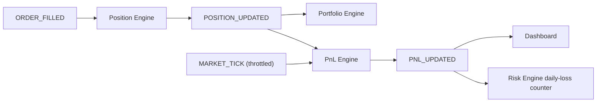

# 13 — Position Engine

> Prerequisites: **[12_ORDER_ENGINE.md](12_ORDER_ENGINE.md)** (`ORDER_FILLED` is the input here), **[02_MASTER_ARCHITECTURE.md](02_MASTER_ARCHITECTURE.md)** §6 (Regime B — this whole chapter is the projection chain), and **[09_EVENT_DRIVEN_SYSTEM.md](09_EVENT_DRIVEN_SYSTEM.md)** §5 (idempotency).

---

## 1. Purpose

This chapter covers the three engines that turn confirmed fills into live financial state — they are documented together because they form one projection chain:

- **Position Engine** — derives *what we hold* (per symbol, per strategy) from fills.
- **Portfolio Engine** — aggregates positions and capital into *what we're worth and what's deployable*.
- **PnL Engine** — computes *whether we're up or down*, realized and unrealized.

None of them makes decisions. They are pure **projections of facts that already happened** (Chapter 02 §6, Regime B): a fill is immutable, and everything here is arithmetic on top of it. That's why they live on the event bus, not the critical path — they can't change whether a trade occurred, only account for it.

---

## 2. Where they sit — the projection chain



The chain fans out from one fact. Note the second input: **unrealized** PnL depends on the *current price*, so the PnL Engine also consumes ticks (throttled) — realized PnL changes only on fills; unrealized changes with the market.

---

## 3. Position math (the Position Engine)

All state is derived from fills using fixed formulas. Sign convention: quantities are positive; `side` distinguishes long/short.

**Opening / adding to a position (same side):** the average entry price is the quantity-weighted mean —

```
newQty      = oldQty + fillQty
newAvgEntry = (oldQty × oldAvgEntry + fillQty × fillPrice) / newQty
```

**Why average-entry accounting:** it collapses any number of entry fills into two numbers (`qty`, `avgEntry`) sufficient for exact PnL, without replaying fill history on every tick.

**Reducing / closing (opposite-side fill):** the closed quantity realizes PnL against the average entry —

```
closedQty    = min(fillQty, oldQty)
realizedPnl += direction × (fillPrice − avgEntry) × closedQty − chargesForThisFill
remainingQty = oldQty − closedQty        // avgEntry unchanged for the remainder
```

where `direction = +1` for closing a long, `−1` for closing a short. If `remainingQty = 0`, the position is `CLOSED` (`closedAt` set). `avgEntry` does **not** change on a reduce — only on adds — because the remaining shares were still bought at the same average.

**Charges** (from the fill, Chapter 11 §5) are subtracted into realized PnL at each fill, entry and exit. **Why in PnL and not tracked separately:** the operator's question is "what did this trade actually make?" — an answer that ignores costs is the paper-trading lie Chapter 11 §2 exists to prevent.

**Idempotency (mandatory):** the Position Engine records applied `orderId`s and ignores a re-delivered `ORDER_FILLED` (Chapter 09 §5). Without this, a resync after reconnect would double-count a fill and silently corrupt both position and PnL — recovery must never be able to damage state.

**Ownership:** the Position Engine is the *sole writer* of position state (Chapter 02 §8) — hot copy in Redis, durable copy in `positions` (Chapter 07). It emits `POSITION_UPDATED` after every change.

---

## 4. Portfolio math (the Portfolio Engine)

The portfolio is a pure aggregation — no state of its own beyond configuration:

```
investedValue    = Σ over open positions ( qty × avgEntry )
currentValue     = Σ over open positions ( qty × currentPrice )
totalRealizedPnl = Σ realizedPnl (all positions, today / lifetime as scoped)
availableCapital = allocatedCapital − investedValue + realizedPnlToday
exposure         = investedValue / allocatedCapital
```

`allocatedCapital` comes from `settings` (Chapter 07) — the operator's declared budget for the machine.

**Why a separate Portfolio Engine at all:** two consumers need the *aggregate*, not individual positions — the dashboard (portfolio view) and the **Risk Engine**, whose position-size and exposure checks (Chapter 14) are questions about `availableCapital` and `exposure`. Computing the aggregate once, in one owner, keeps those two consumers reading the same numbers.

---

## 5. PnL math (the PnL Engine)

Two quantities, two different triggers — keeping them distinct is the point of this engine:

**Realized PnL** — locked in by closing fills (§3). Changes **only** on `POSITION_UPDATED`. This is real money made or lost; it is what feeds the Risk Engine's **daily-loss counter** (`risk:` namespace, Chapter 08 §5) via `PNL_UPDATED` — closing the loop so today's outcomes tighten today's pre-trade gate (Chapter 14).

**Unrealized PnL** — the mark-to-market of open positions:

```
unrealizedPnl(position) = direction × (currentPrice − avgEntry) × qty
```

Changes with **every tick**, so it's recomputed from `hot:price` on a throttle and coalesced before emission (Chapter 10 §6) — the dashboard needs a smooth live number, not thousands of updates a second.

**Why the split matters operationally:** realized losses are *facts* that consume the daily-loss budget; unrealized losses are *conditions* that may reverse. The Risk Engine's daily-loss check keys on realized PnL (a deliberate, documented choice — see Chapter 14 for the discussion, including drawdown-based extensions). Conflating the two would make the risk gate either too twitchy (blocking on every adverse tick) or dishonest (ignoring booked losses).

**Scopes:** PnL is reported per position, per strategy (is *this strategy* earning its keep?), and global — the `scope` field on `PNL_UPDATED` (Chapter 09).

---

## 6. End-of-day reconciliation

On `MARKET_CLOSE` (Chapter 09), the chain runs a closing pass:

1. Final mark of open positions at the closing price (last valid tick).
2. Persist the day's realized/unrealized snapshot per scope to **`pnl_snapshots`** (Chapter 07) — the durable equity curve the dashboard's PnL history reads.
3. Verify Redis hot state matches Mongo durable state; log any divergence as `SYSTEM_ERROR`.

**Why a daily reconcile:** projections are event-driven, and Pub/Sub is fire-and-forget (Chapter 09 §4) — a reconcile is the scheduled safety net that catches any drift *daily*, instead of letting a missed event compound silently for weeks. Cheap insurance on a system that runs unattended.

---

## 7. Events & interface

- **Consumes:** `ORDER_FILLED` (position changes), `MARKET_TICK` (unrealized marks, throttled), `MARKET_CLOSE` (EOD pass).
- **Produces:** `POSITION_UPDATED`, `PNL_UPDATED` (Chapter 09).
- **Reads:** `hot:price:{symbol}` (Chapter 08 §5), `settings.capitalAllocation` (Chapter 07).
- **Writes (sole owner):** `positions` collection + `hot:` position/PnL/portfolio keys (Chapter 02 §8).
- **Queried by (read-only):** the Risk Engine (open positions, exposure, availableCapital — Chapter 14) and the control-plane API (dashboard snapshots, Chapter 05).

---

## 8. Failure modes

- **Re-delivered fill** → ignored by `orderId` idempotency (§3). By design, the most likely delivery anomaly is harmless.
- **Missed `POSITION_UPDATED` downstream** → the daily reconcile (§6) and dashboard snapshot-resync (Chapter 06 §6) repair projections from durable truth.
- **Price feed gap** → unrealized PnL holds its last mark and the staleness is visible (Chapter 06 §7); realized PnL is unaffected (it doesn't depend on the live feed).
- **Redis loss** → hot position/PnL state rebuilds from Mongo `positions` + next ticks (Chapter 08 §10–11).

---

## 9. Roadmap

- **Margin-aware capital** — replacing the simple `investedValue` deduction with real margin math (SPAN/exposure) when F&O goes live.
- **Position history analytics** — per-strategy performance stats (win rate, avg R, drawdown) computed from closed positions; feeds future strategy evaluation.
- **Drawdown tracking** — max intraday drawdown per strategy/global, as a richer input to future risk rules (Chapter 14 roadmap).

---

*Previous: **[12_ORDER_ENGINE.md](12_ORDER_ENGINE.md)**  ·  Next: **[14_RISK_ENGINE.md](14_RISK_ENGINE.md)** — the gate everything upstream has been pointing at.*
