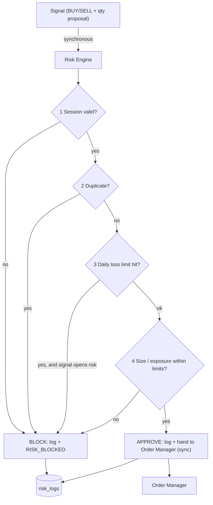

# 14 — Risk Engine

> Prerequisites: **[02_MASTER_ARCHITECTURE.md](02_MASTER_ARCHITECTURE.md)** §6 (Regime A — this engine is *why* that path is synchronous) and §11 (invariant 2). Consumed by every chapter upstream; this is where the gate they all point at is finally specified.

---

## 1. Purpose

The Risk Engine is the **pre-execution gate**: every signal must pass its checks before the Order Manager may submit an order. It is the last component that can say **"no" while "no" still costs nothing.** Its output is binary — approved or blocked-with-reason — and every decision, both ways, is logged.

---

## 2. The ordering proof — why risk runs *before* the broker

The pipeline ordering is fixed and non-negotiable:

```
Signal → Risk → Broker → Position → PnL          ✔  always
Signal → Broker → Risk                            ✘  forbidden, in any form
```

**Why, from first principles:** once an order reaches the broker, capital is committed and the outcome is out of your hands. A risk check performed *after* submission can only *observe* a violation — a duplicate order already placed, a loss limit already breached, a position already oversized. That is not risk management; it is a post-mortem. The entire value of a risk check is that rejection is **free** — and rejection is only free *before* execution.

**The subtler half of the proof — placement inside Regime A:** it is not enough for risk to run "before" the broker in sequence; it must run **atomically** with order placement (Chapter 02 §6). If risk validation and submission were separated by a queue or an event hop, two concurrent signals could *each* pass the duplicate and exposure checks against the same stale state, then *both* execute — the checks passed, the violation happened anyway. This race is why the signal→risk→order path is a synchronous, in-process call chain: **check-and-commit with no interleaving gap.** Any refactor that inserts asynchrony between `validate()` and `place()` silently reintroduces this race and must be rejected as an architectural regression (Chapter 02 §11).

---

## 3. Where it sits



Inputs it reads at decision time: the signal itself; running counters in Redis (`risk:` namespace — daily realized loss, open-order/position counts; Chapter 08 §5); current portfolio aggregates (exposure, `availableCapital`; Chapter 13 §4); session state (`hot:session`); and the limits configuration (§6).

---

## 4. The four checks — what, why, and in what order

The check order is deliberate: **cheapest and most-absolute first**, so obviously-invalid signals are rejected with minimal work and the more stateful checks run only when they can matter.

### Check 1 — Market session validation
- **What:** the exchange session must be open for this instrument, and not within any configured no-trade windows (e.g., the first/last minutes if the operator excludes them).
- **Why:** orders outside the session are either rejected by the exchange or — worse — queued into the next open and executed at an unintended price. A signal produced by a stale tick after close must die here. **Why first:** it's a single flag read (`hot:session`) and it's absolute — no other check matters if the market is shut.

### Check 2 — Duplicate order check
- **What:** reject if an equivalent intent is already in flight or already open — same strategy + symbol + side with a `PLACED`/`PENDING` order, or an already-open position this signal would merely stack (beyond what the strategy's config permits).
- **Why:** duplicates are the classic autonomous-system failure — a strategy that signals on every candle while its condition stays true would, unguarded, fire the same trade repeatedly, multiplying exposure far beyond anything the operator configured. This check is the *reason* atomicity (§2) matters most: it reads in-flight state, so it is exactly the check a race would defeat.
- **Backstop:** even past this check, the Order Manager's unique `signalId` index (Chapter 12 §6) makes one-order-per-signal a database guarantee. Two layers, because duplicate execution costs money silently.

### Check 3 — Daily loss check
- **What:** if today's **realized** loss (the `risk:` counter, fed by `PNL_UPDATED` — Chapter 13 §5) has reached the configured daily maximum, block all signals that would **open or increase** risk, for the rest of the day.
- **Why:** the daily loss limit is the operator's circuit breaker against a bad day becoming a catastrophic one — a strategy misbehaving in an unexpected regime will otherwise keep losing in small, individually-reasonable increments. The limit converts "hope it turns around" into a hard stop.
- **Why realized, not unrealized:** realized losses are booked facts; unrealized is a condition that may reverse. Keying the breaker on unrealized would make it fire on every adverse tick (twitchy); ignoring realized would make it dishonest (Chapter 13 §5). Drawdown-based tightening is a documented roadmap extension (§9), not the base rule.

### Check 4 — Position size / exposure check
- **What:** the proposed quantity must respect (a) max size per position, (b) max capital per trade / per strategy allocation, (c) max total open positions, and (d) max portfolio exposure — using `availableCapital` and `exposure` from the Portfolio Engine (Chapter 13 §4). The engine **validates or caps** the strategy's proposed quantity; it never invents one.
- **Why:** position sizing is where a single wrong decision does the most damage — a fat-fingered config or a runaway signal proposing 10× normal size must be stopped regardless of how good the signal looks. Exposure caps additionally stop *many individually-valid* trades from concentrating into one oversized bet.
- **Why last:** it's the most computation and the most state; running it only for signals that survived the absolute checks keeps the hot path lean.

> **Config layering:** all four checks read limits from `settings.globalRiskLimits`, overridable per strategy by `strategies.riskRules` (Chapter 07) — with the rule that a strategy override may only be **stricter** than the global limit, never looser. **Why:** global limits are the operator's outer safety envelope; a per-strategy config must never be able to widen it.

---

## 5. The entry/exit asymmetry (easy to get wrong, so it's explicit)

Risk checks distinguish **risk-increasing** signals (opening or adding to a position) from **risk-reducing** signals (closing or trimming one):

- **Daily-loss and exposure limits block only risk-increasing signals.** A stop-loss exit or a square-off must **never** be blocked by the loss limit — blocking an exit would trap the system in a losing position at the exact moment the limits say "reduce risk," turning the safety mechanism into a harm amplifier.
- Session and duplicate checks still apply to exits (you can't exit into a closed market; you shouldn't double-fire the same exit).

**The rule in one line: when limits are breached, the machine may still get *out* of positions — it may not get *into* new ones.**

---

## 6. Public interface & decision contract

- `validate(signal) → { decision: approved | blocked, failedCheck?, reason?, cappedQty? }` — called **synchronously** by the strategy runner / signal path (Chapter 02 §6); on approval the flow proceeds synchronously to `OrderManager.place()` (Chapter 12).
- Owns (sole writer): the `risk:` Redis counters (Chapter 08 §5) — daily realized loss (reset at session start), open counts — reconciled against durable truth daily (Chapter 13 §6).

---

## 7. Logging — every decision, both ways

Every `validate()` call writes a `risk_logs` record: the signal, **each check with its pass/fail and the values it saw**, and the final decision (Chapter 07). Blocks additionally emit `RISK_BLOCKED` (Chapter 09) so the operator sees them live.

**Why approvals are logged too, not just blocks:** the audit question after a bad trade is *"why was this allowed?"* — answerable only if approvals record what the checks saw at decision time. The audit question after a missed trade is *"why was this blocked?"* Both directions must be reconstructable, or determinism (Chapter 02, Principle 1) buys you nothing forensically.

---

## 8. Relationship to the kill switch

The kill switch and the Risk Engine are **separate mechanisms by design** (Chapter 12 §4): the Risk Engine evaluates *signals* against *rules*; the kill gate at the Order Manager ignores signals entirely and answers "is the machine allowed to trade at all?" Keeping them separate means the kill path stays maximally simple — one persisted flag (Chapter 07 `settings`, restart-safe), one gate, no rule evaluation that could itself fail. The Risk Engine can *trigger* an automatic pause — on daily-loss breach it invokes the same settings-update path the operator's pause button uses (Chapter 05 §4), flipping `tradingEnabled` off through its owner rather than writing the flag itself (preserving single-writer, Chapter 02 §8). The *enforcement* point remains the choke point either way, and an auto-pause is surfaced to the operator exactly like a manual one.

---

## 9. Failure modes & roadmap

- **Risk state unavailable (Redis down):** **fail closed.** If the engine cannot read its counters or portfolio aggregates, it blocks — an unverifiable signal is an unapproved signal. Availability is never traded for safety (consistent with Chapter 08 §11: no Redis, no new orders).
- **Counter drift:** the daily reconcile (Chapter 13 §6) re-derives counters from durable `positions`/`orders`; divergence logs `SYSTEM_ERROR`.
- **Roadmap:** drawdown-based dynamic tightening (shrink size limits as intraday drawdown grows); per-symbol exposure caps and correlation-aware limits; cooldown-after-loss rules (a strategy that just stopped out must wait N minutes); volatility-scaled position sizing.

---

*Previous: **[13_POSITION_ENGINE.md](13_POSITION_ENGINE.md)**  ·  Next: **[15_STRATEGY_ENGINE.md](15_STRATEGY_ENGINE.md)** — the lifecycle that produces the signals this gate judges.*
