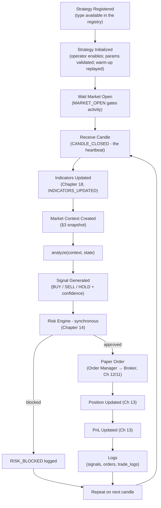

# 15 — Strategy Engine

> Prerequisites: **[14_RISK_ENGINE.md](14_RISK_ENGINE.md)** (where every signal goes), **[18_INDICATOR_ENGINE.md](18_INDICATOR_ENGINE.md)** (what strategies read), **[09_EVENT_DRIVEN_SYSTEM.md](09_EVENT_DRIVEN_SYSTEM.md)** (`CANDLE_CLOSED` — the heartbeat).

---

## 1. Purpose

The Strategy Engine is the **runner**: it hosts every enabled strategy, feeds each one a complete market context on every relevant candle, collects the signals they emit, and hands those signals — synchronously — to the Risk Engine. It also watches open positions against each strategy's stop-loss/target and emits the corresponding exit signals.

The division of labor that keeps strategies simple: **strategies are pure decision functions; the engine owns everything else** — scheduling, data assembly, lifecycle, exits, and the handoff to risk.

---

## 2. The Strategy contract

Every strategy — all of Chapter 16 — implements one interface:

```
Strategy {
  type: string                       // "EMA_CROSSOVER", "ORB", ...
  requiredIndicators(params): spec   // what the context must contain
  warmupBars(params): number         // history needed before first valid analysis
  init(params, symbol): state        // per-symbol instance state
  analyze(context, state): Signal    // the decision function
}
```

`analyze()` returns `{ side: BUY | SELL | HOLD, confidence, qtyProposal, stopLoss, target, reason }`.

**Why this shape, clause by clause:**
- **`analyze()` is pure and synchronous** — context in, signal out, no I/O, no side effects. This is what makes a strategy *deterministic* (Chapter 02, Principle 1), unit-testable with a fabricated context, and safe on the hot path (Chapter 02 §9: no blocking work).
- **`requiredIndicators()` is declarative** so the engine — not the strategy — arranges for the right indicators to exist (Chapter 18). A strategy never computes its own EMA; one indicator implementation serves everyone (single source of truth for math).
- **`warmupBars()` exists because indicators lie when young.** An EMA over 21 bars computed from 3 bars of history is a wrong number that *looks* valid. The engine refuses to call `analyze()` until warm-up history (from `candles`, Chapter 07) has been replayed — correctness from the first live signal, not after ten minutes of bad ones.
- **`stopLoss`/`target` ride on the entry signal** because the *strategy* is the authority on its own exit logic (an ORB stop belongs at the range boundary; a SuperTrend stop trails the line). The engine enforces them (§5); the strategy defines them.
- **`reason` is mandatory** — a one-line human-readable justification ("fast EMA 9 crossed above slow EMA 21") persisted with the signal (Chapter 07 `signals`). Auditability again: numbers say *what*, the reason says *why*.

---

## 3. The Market Context Builder

Before each analysis, the engine assembles **one immutable snapshot** per symbol:

```
context = {
  symbol, candle,                       // the just-closed bar
  candles: last N bars,                 // window for pattern logic
  indicators: { ema, rsi, vwap, ... },  // per requiredIndicators()
  session: { phase, minutesSinceOpen }, // from hot:session
  position: current open position?,     // this strategy's, this symbol
  sentiment: AI confidence contribution // cached, Phase 2 (Chapter 20)
}
```

Sources: `hot:price`/`hot:indicators`/`hot:session` (Chapter 08 §5), the candle window, the strategy's own open position (read-only from the Position Engine, Chapter 13 §7), and the **cached** AI sentiment (Chapter 20 — cached precisely so no LLM call ever sits on this path, Chapter 02 §9).

**Why a built snapshot instead of letting strategies read Redis directly:** three reasons. *Consistency* — every value in the context is from the same instant; a strategy reading keys itself mid-tick could see price from now and indicators from one bar ago and act on a contradiction. *Isolation* — strategies get no infrastructure access, so a buggy strategy cannot write anywhere or block anything. *Testability* — a context is a plain object you can construct in a test.

**Why `position` is in the context:** a strategy must know whether it's flat or holding to decide between "enter" and "manage/exit" — without it, every strategy would re-fire entries (and lean entirely on the Risk Engine's duplicate check, which is a backstop, not the design).

---

## 4. The lifecycle

The canonical loop, exactly as the system runs it:



Stage notes (the *why* per stage):

- **Registered** — the strategy *type* exists in a registry keyed by `type`. **Why a registry:** the operator's stored config (`strategies.type`, Chapter 07) is data; the registry maps data → code, so adding a strategy to the library is one registration, and an unknown type fails loudly at enable time instead of mysteriously at runtime.
- **Initialized** — on enable, params are validated against the strategy's Zod schema (bad config rejected at the boundary, Chapter 04 §4), per-symbol instances are created via `init()`, and **warm-up replays historical candles** so indicators and state are correct before the first live decision.
- **Wait Market Open** — instances idle until `MARKET_OPEN`; `MARKET_CLOSE` stops new entries and triggers any square-off behavior (Chapter 09). Session-awareness lives here *and* in Risk check 1 — belt and suspenders, because a session violation is cheap to stop twice and expensive to miss once.
- **Receive Candle → analyze()** — `CANDLE_CLOSED` is the heartbeat: **strategies decide on closed bars, not raw ticks.** Why: an in-progress bar's values flicker; deciding on it means acting on data that may reverse before the bar completes. Closed-bar analysis is what makes decisions reproducible against history (and backtestable, Chapter 27).
- **Signal → Risk → Order** — the synchronous handoff (Chapter 02 §6, Regime A). `HOLD` signals are recorded (they document that the strategy looked and chose inaction — part of the audit trail) but obviously don't proceed to risk.
- **Repeat** — the loop continues per symbol, per candle, until disabled or the session ends.

---

## 5. Exit monitoring (stop-loss & target)

Entry signals carry `stopLoss` and `target` (§2). The engine's **position watcher** monitors each open position against them on incoming prices and, when either is hit, emits the corresponding **exit signal into the same pipeline** — through the Risk Engine (where exits are risk-*reducing* and pass under the asymmetry rule, Chapter 14 §5) and the Order Manager like any other signal.

**Why exits go through the pipeline instead of firing a direct broker call:** one road to an order (invariant 3). An exit that bypassed the choke point would evade the kill gate, the audit trail, and the duplicate check — the exact ad-hoc path this architecture forbids. **Why the engine watches rather than each strategy polling ticks:** SL/target monitoring is identical machinery for every strategy; centralizing it keeps `analyze()` pure and runs the price comparison once per position, not once per strategy implementation. (Strategies with *dynamic* exits — e.g., SuperTrend's trailing stop — update their stop via their next `analyze()`; the watcher enforces whatever the current stop is.)

---

## 6. Confidence

Every signal carries `confidence ∈ [0,1]`: the strategy's base conviction (e.g., scaled by how decisive its condition was), optionally modulated by the AI sentiment already in the context (Chapter 20 — the AI raises or lowers confidence; it never creates or vetoes signals, Chapter 00 §4). Consumers: a configurable **minimum-confidence threshold** (below it, the signal is recorded but not forwarded to risk) and, on the roadmap, confidence-scaled position sizing. **Why a numeric confidence rather than binary signals:** it gives the AI layer a bounded, auditable input channel — the only kind it's allowed to have.

---

## 7. Isolation & failure modes

- **One strategy instance per (strategy, symbol)**, state private to `init()`'s return — no shared mutable state between strategies. **Why:** strategies must not be able to corrupt each other; N strategies on M symbols are N×M independent decision functions.
- **A throwing `analyze()`** is caught by the engine: logged as `SYSTEM_ERROR` with the context snapshot, the instance is marked errored (and auto-disabled after repeated failures, notifying the operator). **Why contain rather than crash:** one buggy strategy must never take down the pipeline for the others.
- **Slow `analyze()`** — flagged by monitoring (Chapter 23); a strategy that blocks the loop violates the purity contract and is a bug, not a tuning problem.
- **Missed candle / feed gap** — the strategy simply doesn't run for that bar; warm-up state repair on the next bars, and staleness is visible (Chapter 06 §7).

---

## 8. Data & events

- **Consumes:** `CANDLE_CLOSED` (heartbeat), `INDICATORS_UPDATED`, `MARKET_OPEN`/`MARKET_CLOSE`; reads `hot:*`, `cache:strategies:enabled` (Chapter 08).
- **Produces:** `SIGNAL_CREATED` (Chapter 09); writes `signals` (sole owner, Chapter 02 §8); synchronous calls into Risk → Order.
- **Config:** `strategies` collection (Chapter 07), cache-busted on operator change (Chapter 08 §4) so enable/disable takes effect immediately.

---

## 9. Roadmap

- **Backtest harness** — running the same `analyze()` against recorded candles (Chapter 11 §11, Chapter 27); the pure-function contract makes this nearly free.
- **Multi-timeframe contexts** (e.g., a 5m strategy consulting the 15m trend).
- **Per-strategy performance feedback** (Chapter 13 §9) feeding auto-disable of persistently losing strategies.

---

*Previous: **[14_RISK_ENGINE.md](14_RISK_ENGINE.md)**  ·  Next: **[16_STRATEGY_LIBRARY.md](16_STRATEGY_LIBRARY.md)** — the eight strategies, mathematically.*
