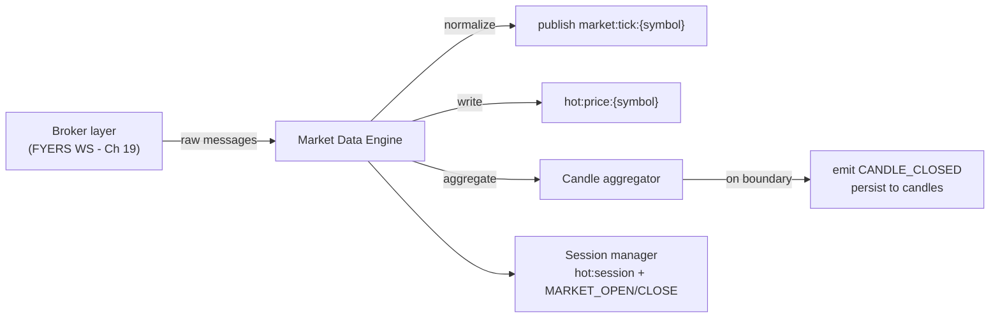

# 17 — Market Data Engine

> Prerequisites: **[19_BROKER_INTEGRATION.md](19_BROKER_INTEGRATION.md)** (the raw feed arrives through the broker layer) and **[08_REDIS_ARCHITECTURE.md](08_REDIS_ARCHITECTURE.md)** §3, §5 (where this engine's output lives).

---

## 1. Purpose

The Market Data Engine is the system's **entry point for market reality**: it receives the raw broker feed, normalizes it into the internal tick shape, aggregates ticks into candles, maintains the hot price snapshot and the session state, and publishes all of it. Everything downstream — indicators, strategies, PnL marks, the dashboard — sees the market *only* through this engine's output.

---

## 2. Why a normalization boundary exists

The broker's wire format (FYERS field names, encodings, quirks) must stop **here**. The engine translates every raw message into the internal tick/candle shape defined in `core` (Chapter 03), and nothing downstream ever sees a FYERS payload.

**Why:** the broker is interchangeable (Chapter 02 §2.4). If strategies or indicators consumed FYERS-shaped data, swapping brokers would mean rewriting the pipeline; with the boundary, a new broker means a new adapter in the broker layer and *zero* downstream change. The normalization boundary is broker-interchangeability applied to data, exactly as the `Broker` interface applies it to orders.

---

## 3. Where it sits & what it owns



Per the ownership map (Chapter 02 §8), this engine is the **sole writer** of: `hot:price:*`, `hot:session`, the `market_ticks` collection (sampled/TTL, Chapter 07), and — via its aggregator — the `candles` collection.

---

## 4. The tick path

1. **Receive** a raw message from the broker layer's data callback (Chapter 19).
2. **Normalize** to the internal tick `{ symbol, ltp, volume, bid, ask, ts }` — mapping fields, converting units, using the **exchange timestamp** where the broker provides one. **Why exchange time:** candles and audit records must be anchored to when the market moved, not when our process happened to receive the packet; receive-time skew would misalign bars.
3. **Write** `hot:price:{symbol}` (the snapshot every consumer shares — the strategy's context, the Paper Broker's fill price, the PnL mark all read this one key; Chapters 8 §5, 11 §4, 13 §5).
4. **Publish** on `market:tick:{symbol}` (fan-out, Chapter 08 §3).
5. **Feed the aggregator** (§5). Persistence to `market_ticks` is sampled/asynchronous — never a synchronous Mongo write per tick (Chapter 09, `MARKET_TICK` logging rationale).

The per-tick work is deliberately tiny — normalize, one Redis write, one publish, one in-memory accumulate — because this path runs thousands of times a second on the shared event loop (Chapter 02 §9).

---

## 5. Candle aggregation

Ticks accumulate into interval buckets; on each boundary the bar closes:

```
bucket(ts, interval) = floor(ts / interval)
open  = first tick's ltp in bucket        high = max(ltp)
low   = min(ltp)                          close = last tick's ltp
volume = Σ tick volume deltas
```

On boundary crossing: finalize the bar → persist to `candles` (unique `{symbol, interval, ts}`, Chapter 07) → emit `CANDLE_CLOSED` → open the next bucket. Higher intervals (5m, 15m) are composed from 1m bars — **why derive rather than aggregate each independently:** one aggregation source means the 5m bar is always exactly its five 1m bars; independent accumulators could disagree at edges.

**Why the engine owns candle-closing (and its timing):** `CANDLE_CLOSED` is the pipeline's heartbeat (Chapter 15 §4) — strategies decide on it, indicators update on it. Emitting a bar *before* its boundary (with in-progress data) would hand strategies flickering values; emitting late delays every decision. One owner, one clock. A bucket with zero ticks (illiquid symbol) produces no bar rather than a fabricated flat one — absent data is represented as absent, not invented (the same honesty rule as Chapter 11 §9).

---

## 6. Session management

A small session manager inside this engine tracks the exchange calendar and clock (NSE/BSE: 09:15–15:30 IST, holidays) and:

- writes `hot:session` (`pre-open` / `open` / `closed`),
- emits `MARKET_OPEN` / `MARKET_CLOSE` (Chapter 09).

**Why it lives here:** session state is a property of *market data reality* — the same source that knows whether ticks should be flowing is the right authority on whether the market is open. Consumers: strategy gating (Chapter 15 §4), the Risk Engine's session check (Chapter 14 §4.1), the Paper Broker's validation (Chapter 11 §4), EOD reconciliation (Chapter 13 §6). One authority, many readers — ownership rule as usual.

---

## 7. Subscription management

The engine subscribes to the broker feed **only for symbols required by enabled strategies** (the union of `strategies.symbols` for enabled configs, Chapter 07), adjusting live when the operator enables/disables a strategy (via the config cache-bust, Chapter 08 §4).

**Why not subscribe to everything:** broker feeds cap concurrent symbol subscriptions and bill/throttle by volume; every subscribed symbol also costs tick-path work (§4). Subscribing to exactly the working set keeps the hot path proportional to what the operator actually configured.

---

## 8. Failure modes & recovery

- **Feed silence during an open session** — no ticks for a threshold interval across subscribed liquid symbols → treat as a suspected feed failure even if the socket *looks* connected: log, surface staleness (Chapter 06 §7), and let the broker layer's health check confirm/reconnect (Chapter 19). **Why not trust the socket state alone:** a connected-but-silent feed is the most dangerous failure — the system would otherwise trade on frozen prices.
- **`BROKER_DISCONNECTED`** → mark prices stale; on `BROKER_CONNECTED`, **re-subscribe the full working set** (subscriptions don't survive reconnect) and resume. Order-side halting is the Order Manager's job (Chapter 12 §7); this engine handles the data side.
- **Out-of-order / duplicate ticks** — guarded by per-symbol last-`ts` tracking; a tick older than the last applied one updates nothing (monotonic hot state).
- **Gap across a candle boundary** (disconnect spanning bar close) — the affected bar closes with what it has or not at all; downstream warm-up and the honest-absence rule (§5) apply. No synthetic back-fill in Phase 1 (roadmap: broker historical-candle back-fill on reconnect).

---

## 9. Events & interface

- **Consumes:** the broker layer's raw data callback (in-process); `BROKER_CONNECTED/DISCONNECTED` (Chapter 09).
- **Produces:** `MARKET_TICK`, `CANDLE_CLOSED`, `MARKET_OPEN`, `MARKET_CLOSE` (Chapter 09).
- **Writes (sole owner):** `hot:price:*`, `hot:session`, `market_ticks`, `candles`.

---

## 10. Roadmap

- **Historical back-fill on reconnect** — fetch missed candles from the broker's history API so indicator state repairs instantly after a gap.
- **Pre-open handling** — NSE pre-open auction data as a distinct session phase for strategies that want it (OHL/Gap Up refinement).
- **Multi-source failover** — a second data vendor behind the same normalization boundary; the boundary (§2) is what makes this a bounded change.

---

*Previous: **[16_STRATEGY_LIBRARY.md](16_STRATEGY_LIBRARY.md)**  ·  Next: **[18_INDICATOR_ENGINE.md](18_INDICATOR_ENGINE.md)** — turning these candles into the numbers strategies reason about.*
