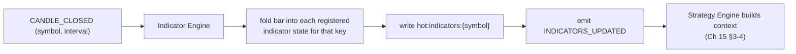

# 18 — Indicator Engine

> Prerequisites: **[17_MARKET_DATA_ENGINE.md](17_MARKET_DATA_ENGINE.md)** (candles in), **[15_STRATEGY_ENGINE.md](15_STRATEGY_ENGINE.md)** §2 (`requiredIndicators()` / `warmupBars()`), **[16_STRATEGY_LIBRARY.md](16_STRATEGY_LIBRARY.md)** §0 (the formulas themselves).

---

## 1. Purpose

The Indicator Engine computes every derived value strategies reason about — EMA, RSI, VWAP, ATR/SuperTrend, volume averages — from candles, incrementally, in one place. Strategies **declare** what they need (Chapter 15 §2); this engine makes those values exist, correct and current, in `hot:indicators:{symbol}` before any strategy runs.

---

## 2. Why indicators are centralized (not computed inside strategies)

Three reasons, in descending order of importance:

1. **One source of truth for math.** If each strategy computed its own EMA, two implementations could disagree by a seeding detail — and a decision audit would face two "EMA(21)" values for the same bar. One implementation (in the pure `indicators` package, Chapter 03) means one answer, tested once (Chapter 27).
2. **Deduplication.** Five strategies requiring `EMA(21)` on `RELIANCE@5m` cost **one** computation, not five. The engine collects `requiredIndicators()` across enabled strategies and computes the *union*, keyed by `(symbol, interval, indicator, params)`.
3. **Purity of strategies.** Strategies stay pure decision functions (Chapter 15 §2); all stateful, sequential computation lives here, where it's managed once.

---

## 3. Incremental computation (the hot-path discipline)

Every indicator here admits an **O(1) per-bar update**: the engine keeps a small state per `(symbol, interval, indicator, params)` and folds each new closed candle into it, rather than recomputing over history.

```
EMA:        state = { ema }                 ema' = α·C + (1−α)·ema
RSI:        state = { avgGain, avgLoss }    Wilder-fold the new bar
ATR:        state = { atr }                 Wilder-fold TR
SuperTrend: state = { finalUpper, finalLower, trend }   carry-forward rules (Ch 16 §7)
VWAP:       state = { Σ(TP·V), ΣV }         accumulate; ratio on read
SMA/avgVol: state = ring buffer of N values
```

**Why incremental is mandatory, not an optimization:** this engine runs on every `CANDLE_CLOSED` for every symbol × interval × indicator on the shared event loop (Chapter 02 §9). Recomputing an EMA from 200 bars of history on each close would multiply hot-path work by orders of magnitude for identical results. Incremental math is also *why* warm-up (§4) is a hard requirement — recursive state must be seeded from history to be correct.

---

## 4. Warm-up (why the first values must wait)

A recursive indicator's current value embeds its history: `EMA(21)` folded from 3 bars is a confidently *wrong* number. So:

1. On startup, or when a strategy/symbol is enabled, the engine loads historical bars from `candles` (Chapter 07 — this is precisely why that collection has long retention) — at least `max(warmupBars())` across the strategies using each indicator.
2. It **replays** them through the same fold functions, applying each formula's seeding rule (SMA-seed for EMA, mean-seed for RSI — Chapter 16).
3. Only then is the indicator marked **ready**.

**Readiness gating:** `hot:indicators:{symbol}` carries a per-indicator `ready` flag; the Market Context Builder includes only ready values, and the Strategy Engine will not call `analyze()` for a strategy whose required indicators aren't all ready (Chapter 15 §2). **Why gate rather than serve best-effort values:** a strategy acting on an unconverged indicator produces plausible-looking but unfounded signals — the least detectable kind of wrong. Absence is honest; a bad number is not (the recurring rule: Chapters 11 §9, 17 §5).

If Mongo history is insufficient (new symbol, short listing), the indicator warms up from live bars and stays not-ready until it has enough — the strategy simply starts later that day.

---

## 5. Session-anchored indicators

VWAP (and any future session-anchored value) **resets on `MARKET_OPEN`** — its accumulators zero at the bell, fulfilling the requirement stated in Chapter 16 §4: VWAP's meaning *is* "the average price paid today," and carrying accumulation across sessions destroys it. The engine distinguishes *rolling* indicators (EMA/RSI/ATR — state persists across days, warm-up spans days) from *session* indicators (VWAP — state resets daily, no cross-day warm-up needed), and applies the right lifecycle to each. Getting this classification wrong is a silent-corruption bug, which is why it's explicit in each indicator's registration.

---

## 6. The update cycle



Ordering matters: indicators fold **before** strategies analyze the same bar (the lifecycle order in Chapter 15 §4 — Receive Candle → Indicators Updated → Context → Analyze). The engine's write to `hot:indicators` and its `INDICATORS_UPDATED` emission are what sequence this: the Strategy Engine builds context on the indicator update for the bar, not on the raw candle event, so `analyze()` always sees indicators that *include* the bar it's deciding on.

---

## 7. Data, events & interface

- **Consumes:** `CANDLE_CLOSED`, `MARKET_OPEN` (session resets, §5); reads `candles` for warm-up.
- **Produces:** `INDICATORS_UPDATED` (Chapter 09).
- **Writes (sole owner):** `hot:indicators:{symbol}` (Chapter 02 §8) — deliberately **not** persisted to Mongo: every value is recomputable from `candles`, so durable storage would duplicate derivable data (Chapter 07 §2, and the `INDICATORS_UPDATED` logging note in Chapter 09).
- **Interface:** pure functions in the `indicators` package (`emaFold`, `rsiFold`, …), consumed by this engine for live state and directly by tests/backtests (Chapter 27) — the same math in both places, by construction.
- **Audit note:** although indicator state isn't persisted, the values a decision *saw* are — inside the signal's `contextSnapshot` (Chapter 07 `signals`). Live values are ephemeral; decision-time values are permanent.

---

## 8. Failure modes

- **Insufficient history** → not-ready, strategies gated (§4); logged so the operator knows why a strategy is idle.
- **Redis loss** → indicator hot state is rebuilt by re-running warm-up from `candles` (Chapter 08 §10) — the recoverability that justifies keeping it in Redis only.
- **Malformed bar / NaN** → the fold rejects it, keeps prior state, marks the indicator suspect, and logs `SYSTEM_ERROR`; NaN must never propagate into a context (a NaN comparison silently evaluates false and produces phantom non-signals).
- **Missing bar (feed gap)** → state simply doesn't advance for that interval; rolling indicators resume on the next bar (a one-bar gap is within their smoothing tolerance); larger gaps are repaired by back-fill when available (Chapter 17 §10).

---

## 9. Roadmap

- **More indicators as strategies demand them** (Bollinger, MACD, ADX) — each is a new pure fold + registration; the engine doesn't change.
- **Cross-interval derivation** (15m indicators from 1m state) alongside multi-timeframe contexts (Chapter 15 §9).
- **Warm-up from broker history API** (Chapter 17 §10) to make cold-start instant for new symbols.

---

*Previous: **[17_MARKET_DATA_ENGINE.md](17_MARKET_DATA_ENGINE.md)**  ·  Next: **[19_BROKER_INTEGRATION.md](19_BROKER_INTEGRATION.md)** — the FYERS boundary at both ends of the pipeline.*
