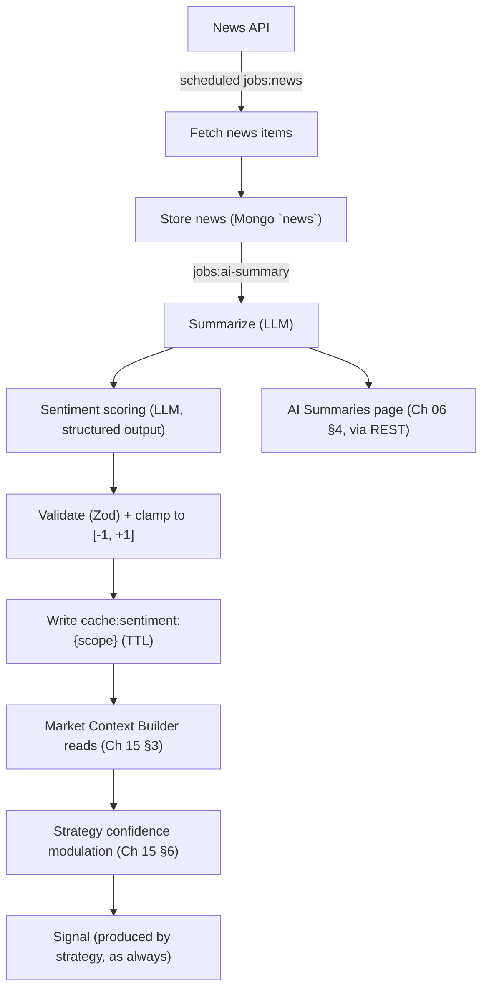

# 20 — AI Engine

> Prerequisites: **[00_PROJECT_OVERVIEW.md](00_PROJECT_OVERVIEW.md)** §4 (advisor, never executor), **[08_REDIS_ARCHITECTURE.md](08_REDIS_ARCHITECTURE.md)** §6 (BullMQ — where all of this runs), **[15_STRATEGY_ENGINE.md](15_STRATEGY_ENGINE.md)** §3, §6 (where its output lands).

---

## 1. Purpose

The AI Engine is the intelligence plane (Chapter 02 §4): it reads market news, summarizes it, scores sentiment, and contributes a **bounded numeric confidence input** to the market context. It makes the deterministic strategies smarter about the world.

The boundary, stated as bluntly as Chapter 00 does: **the AI never places orders.** It cannot create a signal, cannot veto one, cannot talk to the Risk Engine or the Order Manager, and has no code path to a broker. Its entire influence on trading is one clamped number that strategies may weigh.

---

## 2. Why the boundary is architectural, not aspirational

LLM output is non-deterministic and can hallucinate (Chapter 02 §4). Letting it near execution would break both load-bearing safety properties at once: determinism (Chapter 02, Principle 1 — same inputs would no longer produce the same trade) and auditability (you cannot replay a hallucination). The design therefore **quarantines** the AI:

- It runs **only in background jobs** (BullMQ, Chapter 08 §6) — structurally *outside* the synchronous critical path (Chapter 02 §6, Regime A). There is no call site where the pipeline invokes an LLM.
- Its only write is a **cached, clamped score** the Market Context Builder reads (Chapter 15 §3). The deterministic pipeline consumes a *number computed out-of-band*, exactly like it consumes an indicator — with the number's provenance logged.
- The consumption rule is fixed by Chapter 15 §6: sentiment **modulates a strategy's confidence within configured bounds**; it never originates a side. A strategy whose condition didn't fire produces no signal for any sentiment value.

This is the same shape as every other safety property in this book: not a policy someone must remember, but a structure with no path to violate.

---

## 3. The lifecycle

Stage by stage:

1. **Fetch** — a scheduled `jobs:news` job pulls from the configured news source(s) for the tracked symbols/sectors/market. Queued because news APIs are slow and flaky — retries and rate-pacing come free from BullMQ (Chapter 08 §6).
2. **Store** — raw items land in the `news` collection (Chapter 07): headline, source, symbols, publish time, and later their derived summary/sentiment. **Why store the raw item:** auditability — when a sentiment score influenced a trade, the operator must be able to see *which news* produced it.
3. **Summarize** — an LLM condenses items into the operator-readable market summaries shown on the dashboard (Chapter 06 §4).
4. **Score sentiment** — an LLM produces a **structured** verdict per scope (symbol / sector / market): `{ score, rationale }`.
5. **Validate & clamp** — the structured output is parsed against a Zod schema; the score is clamped to `[-1, +1]`. Anything malformed is **discarded** (job fails → retries → dead-letters), never coerced. **Why:** this is the hallucination firewall — a model returning prose, a wild number, or the wrong shape gets zero influence rather than creative parsing.
6. **Cache** — the validated score is written to `cache:sentiment:{scope}` **with a TTL**. **Why a TTL is a safety feature:** sentiment decays. Morning news must not still be nudging confidence at 15:00, and if the AI subsystem dies, its last opinion must *expire* rather than fossilize. Expiry ⇒ neutral (§4).
7. **Consume** — the context builder includes the cached value (or neutral); strategies modulate confidence per Chapter 15 §6; the value a decision actually saw is preserved forever in the signal's `contextSnapshot` (Chapter 07 `signals`).

---

## 4. Degradation: the AI's absence must be invisible

If the news API is down, the LLM errors, or every score has expired, the context carries **neutral sentiment (0)** — and the system behaves exactly as it does in Phase 1, trading on pure strategy logic.

**Why neutral-on-absence is the required failure mode:** the AI is an *enhancement layer* on an already-trusted pipeline (Chapter 00 §6 — this is precisely why it's Phase 2). An enhancement that can *block* trading when it fails would have become a dependency, inverting the design. Fail-neutral here is the mirror image of the Risk Engine's fail-*closed* (Chapter 14 §9): risk unavailable ⇒ don't trade (safety gate); AI unavailable ⇒ trade without it (optional advisor). The asymmetry is the point — each failure mode defaults to the safe side of *its own* job.

---

## 5. Data, events & interface

- **Runs in:** BullMQ workers only (`jobs:news`, `jobs:ai-summary`) — never in-process on the tick path.
- **Writes:** `news` collection (sole owner, Chapter 07); `cache:sentiment:{scope}` (TTL'd, Chapter 08 §4-family).
- **Read by:** Market Context Builder (sentiment); dashboard REST (summaries, Chapter 06 §4).
- **Events:** none on the trading bus — deliberate. The AI communicates through cached values and stored documents, not pipeline events; giving it bus presence would invite consumers to *react* to it, which is one step from letting it drive.
- **Cost/rate control:** LLM and news-API calls are paced by the job queue and the rate limiter (Chapter 08 §8) — bounded spend, no burst amplification on a news flood.

---

## 6. Failure modes

- **LLM output malformed** → discarded at validation (§3.5); retried; dead-lettered with the raw output attached for inspection. Influence: zero.
- **News API down** → fetch jobs retry with backoff; sentiment TTLs expire; system runs neutral (§4). Operator notified if the outage persists (stale AI Summaries page is itself a visible symptom).
- **Score present but stale** → impossible by construction: TTL expiry removes it (§3.6).
- **Prompt-injection via news content** → contained by construction: whatever a malicious article makes the model say still has to survive Zod validation and clamping, and the worst achievable effect is a wrong-but-bounded nudge to confidence on signals a strategy independently produced — which then still faces the Risk Engine. The blast radius is a design property, not a prompt-engineering hope.

---

## 7. Roadmap

- **Richer scopes** — per-event-type sentiment (earnings vs. macro), sector rollups.
- **Regime tagging** — AI-labeled market regime (trend/range) as a *suggestion* surfaced to the operator for strategy selection (Chapter 16 §9) — advisory to the human, same boundary as ever.
- **Evaluation loop** — back-scoring sentiment against subsequent price moves to measure whether the AI's nudges actually help, before ever widening its bounds.

---

*Previous: **[19_BROKER_INTEGRATION.md](19_BROKER_INTEGRATION.md)**  ·  Next: **[21_AUTHENTICATION.md](21_AUTHENTICATION.md)** — who may operate the machine.*
