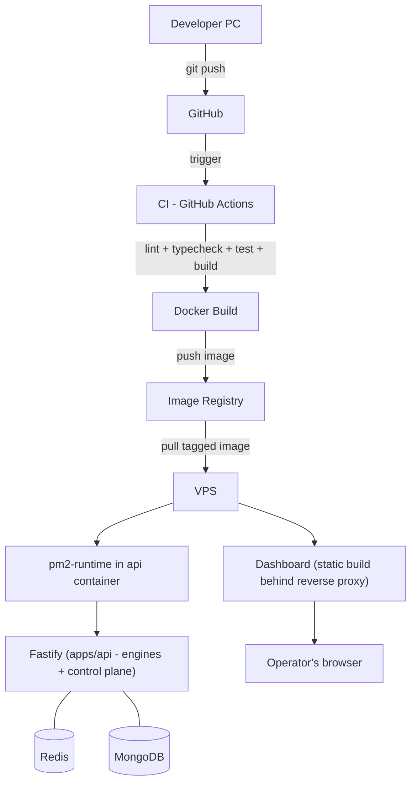

# 22 — Deployment

> Prerequisites: **[04_TECH_STACK.md](04_TECH_STACK.md)** §11 (the ops choices), **[05_BACKEND_ARCHITECTURE.md](05_BACKEND_ARCHITECTURE.md)** §3 (what boots), **[12_ORDER_ENGINE.md](12_ORDER_ENGINE.md)** §8 (why shutdown must be graceful).

---

## 1. Purpose

To specify the path from a developer's keyboard to a running, supervised production stack — and the operational policies (deploy timing, graceful shutdown, rollback, backups) that a *trading* system demands beyond what an ordinary web app would.

---

## 2. The pipeline, stage by stage

**Why each stage exists:**

- **Developer PC → GitHub.** Git is the single source of truth; nothing reaches production except through a commit. No SSH-and-edit on the VPS — an unrecorded production change is an unauditable one, and this book's whole premise is that every decision is reconstructable.
- **GitHub → CI (GitHub Actions).** Every push runs **lint → typecheck → test → build** across the workspace (Turborepo runs only what changed, Chapter 03 §3). **Why a hard gate:** the type-checker and the test suite are the automated reviewers of a money-moving codebase (Chapter 04 §2, Chapter 27); code that hasn't passed them has no route to a broker. A red pipeline blocks the merge — no exceptions clause, because exceptions clauses get used.
- **CI → Docker Build.** The artifact of a green pipeline is an **image**, tagged with the commit SHA. **Why containers:** the image CI tested is *bit-for-bit* the thing production runs — same Node version, same dependencies, same build output. "Works on my machine" is eliminated as a category, and the SHA tag makes every deploy traceable to its exact commit.
- **Registry → VPS.** The VPS pulls the tagged image; docker-compose defines the stack — `api`, `dashboard`, `redis`, `mongo` — on an internal network where **only the reverse proxy is exposed**. **Why a VPS (vs. serverless/managed):** this is a long-lived, stateful process holding WebSocket connections and in-memory engine state (Chapter 02 §9); it needs to run continuously and predictably, not spin up per-request. Full control of the box is the requirement, not a preference (Chapter 04 §11).
- **PM2 (`pm2-runtime`) inside the api container.** PM2 supervises the Node process — crash restart, structured log capture, graceful-reload signaling — while Docker's restart policy supervises the *container*. **Why both layers:** PM2 handles process-level death (an uncaught crash restarts in milliseconds with logs intact); Docker handles container/host-level death. Two small supervisors beat one clever one.
- **Fastify + Redis + MongoDB.** The stack from Chapter 05 §3 boots: config validated (fail-fast — a half-configured money-mover must not start, Chapter 04 §6), engines wired, **kill-flag honored from `settings`** (a restart never silently resumes a killed system, Chapter 07), broker selected, then ready.
- **Dashboard.** Built to static assets in CI, served behind the reverse proxy (Caddy/nginx) which also terminates **TLS** and fronts the api. **Why static + proxy:** the dashboard is a client app (Chapter 06 §8) — it needs a file server and HTTPS, not a runtime; the proxy gives both plus a single hardened ingress (Chapter 24).

---

## 3. Deploy timing — the trading-system rule

**Deploys happen outside market hours. Period.** The pipeline may be green, the change may be one line — production restarts wait for `MARKET_CLOSE`.

**Why a policy and not just good judgment:** a restart mid-session drops the feed, interrupts in-flight broker calls, and forces the unknown-outcome reconciliation path (Chapter 12 §8) *while positions are open*. Every one of those is recoverable by design — and none of them should ever be *caused* by a routine deploy. The recovery machinery exists for failures, not for convenience. (Genuine emergencies use the kill switch first: **halt trading, then patch** — never patch a live-trading process.)

---

## 4. Graceful shutdown & startup

**Shutdown (SIGTERM from PM2/Docker):**
1. Stop accepting new signals (the strategy runner pauses at the top of the loop).
2. **Drain in-flight broker calls** — an order submission in progress completes and its outcome is recorded (you cannot un-send an order; Chapter 12 §8's "kill mid-flight" rule applies to deploys too).
3. Flush pending writes, close Socket.IO (clients show disconnected, Chapter 06 §7), close Redis/Mongo cleanly, exit.

**Startup:** config fail-fast → infra connects → **reconcile any `PLACED`/`PENDING` orders against the broker before trading resumes** (Chapter 12 §8) → honor the persisted kill flag → warm-up (Chapter 18 §4) → subscribe feed → ready.

**Why the sequence is specified here and not left to chance:** the difference between a clean deploy and a data-integrity incident *is* this sequence. It's the operational mirror of the pipeline's own invariants.

---

## 5. Configuration & secrets

Environment-specific config lives on the VPS (env file / secret store readable only by the deploy user), **never in the repository** — DB URIs, session secrets, FYERS app credentials, the token-encryption key (Chapter 24). The image is environment-agnostic; the environment supplies the secrets. CI has no production secrets at all — it builds and tests; it does not talk to production brokers or databases.

---

## 6. Rollback & backups

- **Rollback = redeploy the previous SHA-tagged image.** Because images are immutable and tagged, rollback is a compose-file change and a restart — minutes, not archaeology. The previous N images are always retained.
- **MongoDB backups** — scheduled dumps (post-close, daily) shipped **off the VPS**. **Why off-box:** the failure a backup exists for includes losing the box. `orders`, `positions`, `signals`, `risk_logs` are the audit trail of real money — their loss is not an inconvenience but an unrecoverable hole in the record.
- **Redis persistence** — AOF for the durable namespaces (`jobs:`, `session:`; Chapter 08 §10). Redis is not backed up like Mongo *because* its data is rebuildable or short-lived by design — the namespace/durability table (Chapter 08 §9) is what makes that a safe statement rather than a hope.
- **Restore is rehearsed**, not assumed: a backup that has never been restored is a theory (verification cadence in Chapter 23).

---

## 7. Failure modes

- **CI red** → nothing ships; that's the system working.
- **Deploy fails on the VPS** → the previous containers keep running (compose replaces only on successful start); worst case, explicit rollback (§6).
- **Crash loop after deploy** → PM2 restarts capture logs; Docker backoff prevents thrash; the persisted kill flag means even a crash-looping system isn't a *trading* system until state is verified.
- **VPS loss** → re-provision, restore Mongo from off-box backup, redeploy the tagged image, re-establish broker auth (Chapter 19 §3), verify, resume. The recovery time objective is honest: hours, not seconds — acceptable for a single-operator system whose safe state is "halted."

---

## 8. Roadmap

- **Staging environment** running the full stack against the Paper Broker — the rehearsal space for deploys themselves, gating Phase 3 (Chapter 28).
- **Blue-green on the api container** for near-zero-downtime after-hours deploys.
- **Infrastructure-as-code** for the VPS (compose is already declarative; extend to provisioning) so §7's "VPS loss" recovery is a script, not a runbook.

---

*Previous: **[21_AUTHENTICATION.md](21_AUTHENTICATION.md)**  ·  Next: **[23_MONITORING.md](23_MONITORING.md)** — how you know the machine is healthy.*
